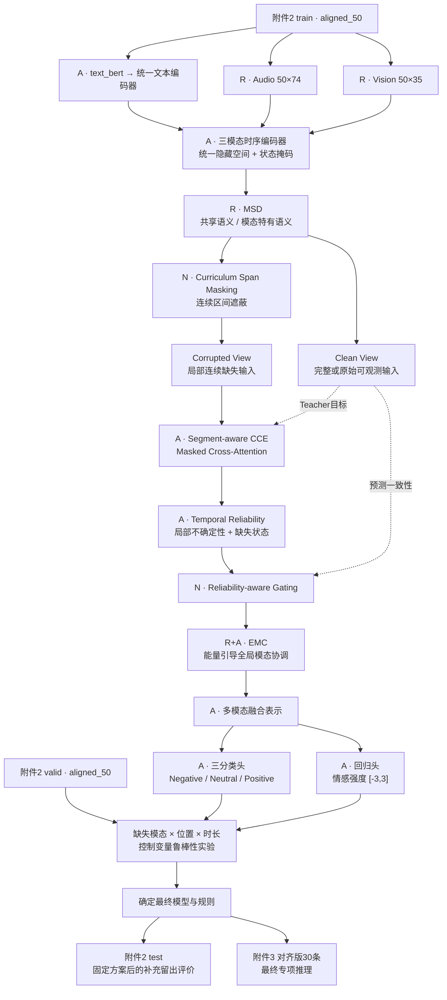
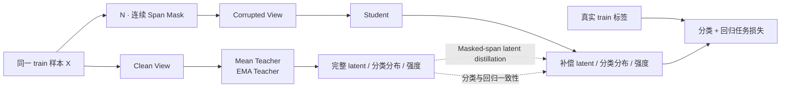
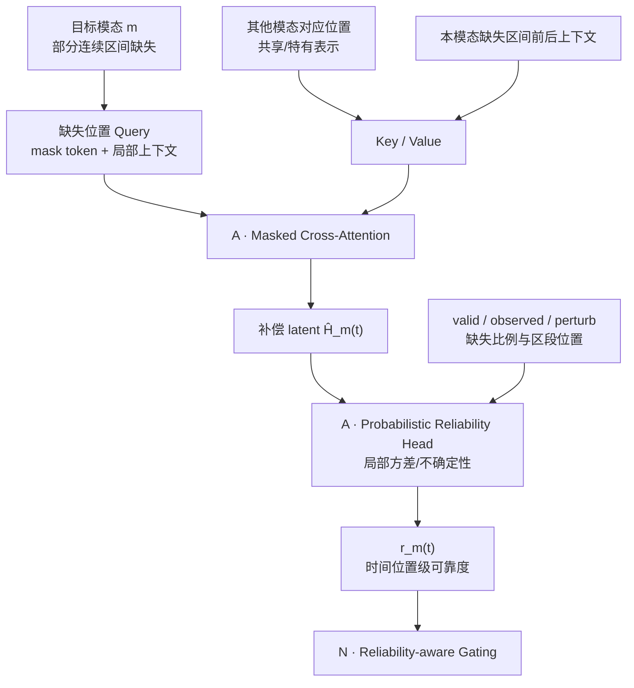
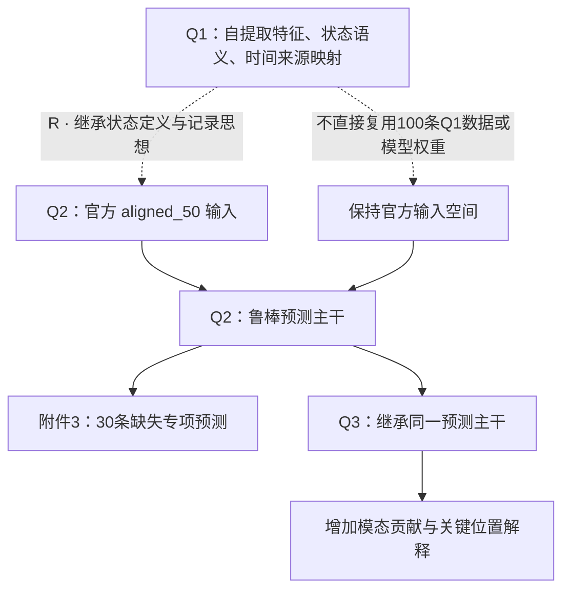

# E题 Q2 模态局部缺失鲁棒情感预测方法（v1 审核稿）

> 2026-09-24。本文只确定 **Q2 的方法结构、数学定义、数据边界、可复用部分和验证方案**，暂不进入网络层数、隐藏维度、学习率、损失权重、训练轮数等实现级参数。
>
> 本稿与已审核的 Q1 v3 保持同一写法：先给整体流程，再给各模块的方法定义；图中 **R=复用已有核心，A=在已有方法上改造，N=本题新增组织/训练机制**。这里的 N 只表示本题方案中的新增模块，不等同于宣称算法原创。
>
> 推荐先审核第1—2节总体结构，再看第5—9节各模块，最后看第10—12节实验、三问衔接和边界。

---

## 1. 本稿建议采用的 Q2 主方法

### 1.1 一句话概括

**以附件2 `aligned_50` 为唯一主特征版本，统一使用 `text_bert → 同一文本编码器`、音频74维和视觉35维构造三模态50步表示；在 EBMC 的“语义分解—跨模态增强—模态协调”骨架上，引入课程式连续区间遮蔽、基于 Masked Cross-Attention 的局部缺失补偿、时间位置级可靠度估计以及 Clean-to-Corrupted Mean Teacher 一致性训练，使模型在部分连续时间段模态不可用时仍稳定输出三分类情感极性与连续情感强度。**

最终主线为：

```text
附件2 aligned_50
    │
    ├─ text_bert → 同一文本编码器
    ├─ audio(50,74)
    └─ vision(50,35)
    │
    ▼
三模态时序编码 + 状态掩码
    │
    ▼
R · MSD：共享 / 模态特有语义分解
    │
    ▼
N · Curriculum Span Masking
连续局部缺失模拟
    │
    ├───────────────┐
    ▼               ▼
Clean View      Corrupted View
Teacher         Student
    │               │
    │               ▼
    │      A · Segment-aware CCE
    │      Masked Cross-Attention
    │               │
    │               ▼
    │      A · Temporal Reliability
    │      局部不确定性 + 缺失状态
    │               │
    │               ▼
    │      N · Reliability-aware Gating
    │               │
    └────── 一致性蒸馏 ──────┘
                    │
                    ▼
              R+A · EMC
            全局模态协调
                    │
                    ▼
             多模态融合表示
              ┌─────┴─────┐
              ▼           ▼
          三分类极性     强度回归
```

### 1.2 本稿相对原始 EBMC 的主要改造

| 模块 | 采用方式 | 本题中的作用 |
| --- | --- | --- |
| MSD | **R**：复用 EBMC 共享/特有语义分解思想 | 减少三模态互相干扰，为后续补偿提供结构化表示 |
| CCE | **A**：由普通跨模态增强改为 Segment-aware Masked Cross-Attention | 只针对连续缺失位置，用其他模态和本模态上下文补偿缺失 latent |
| IMTD / modality trust | **A**：由样本级 reliability 改为时间位置/局部区段级 reliability | 区分“这个模态总体可靠”和“这个位置当前是否可靠” |
| EMC | **R+A**：保留能量引导模态协调，输入改为可靠度门控后的表示 | 处理长期训练中的文本模态主导与弱模态不足问题 |
| 连续缺失模拟 | **N**：Curriculum Span Masking | 与题目“部分连续时间段不可用”直接对应 |
| 完整/受损双视图 | **N**：Mean Teacher / Self-Distillation | 用完整输入指导受损输入，约束预测和缺失段 latent 稳定 |
| 分类/回归输出 | **A**：双任务头 | 同时满足极性三分类和 `[-3,3]` 强度预测 |

### 1.3 一个重要修正：`unaligned_50` 不进入主模型的辅助对比学习

前期讨论过把 `aligned_50` 与 `unaligned_50` 当作同一样本的双视图做 InfoNCE。重新对照题目后，本稿**不把这一做法列入正式主方案**。

原因有三点：

1. 题目明确要求训练、验证和专项测试保持**同一特征版本和同一输入接口**。因此正式方案应选定 aligned 或 unaligned 后贯穿到底，不宜训练期混用两套版本、推理期只保留其中一套。
2. 附件3两套版本没有内部 ID，不能仅凭文件编号认定两套专项样本具有严格相同的扰动位置。
3. 未对齐版音频/视觉各为500步，二者同一个索引也不保证对应同一时刻；若作为主线，需要重新设计异步时序交互与长度处理，会显著增加 Q2 复杂度。

因此正式选择为：

- **主方案：`aligned_50` 训练 → `aligned_50` 验证 → 附件3对齐版预测。**
- `unaligned_50` 仅保留为**独立备选/对照版本**；如后续确需比较，应重新训练一套完全独立的 unaligned 模型，不和 aligned 主模型混合训练。

---

## 2. 方法流程图：用于优先审核

### 图1 Q2 总流程：完整训练、局部缺失学习与专项预测



### 图2 训练时 Clean–Corrupted 双视图



### 图3 连续缺失区间的补偿与可靠度



### 图4 Q1—Q2—Q3 的复用和边界



---

## 3. 题目、数据和版本选择

### 3.1 Q2 的任务输入与输出

Q2 的核心不是恢复完整特征文件，而是在局部连续缺失条件下完成两个预测任务：

1. **情感极性三分类**：Negative / Neutral / Positive；
2. **情感强度回归**：连续值范围 `[-3,3]`。

题目进一步要求分析：

- 缺失模态类型；
- 缺失位置；
- 缺失时长；

对预测性能的影响规律。

因此，缺失补偿模块属于**中间鲁棒表示学习**，不是最终输出任务。

### 3.2 正式采用 `aligned_50`

本稿正式选择附件2 `aligned_50.pkl`，主要接口为：

| 模态 | 主输入 | 形状 |
| --- | --- | --- |
| Text | `text_bert` | `(N,3,50)` |
| Audio | `audio` | `(N,50,74)` |
| Vision | `vision` | `(N,50,35)` |
| 分类标签 | `classification_labels` | `(N,)` |
| 回归标签 | `regression_labels` | `(N,)` |

对齐版的关键优点不是“必然性能更好”，而是：

- 三模态都组织为50个官方序列位置；
- 局部连续区间 mask 能在统一位置坐标中定义；
- CCE 可以直接利用其他模态对应位置的信息；
- 附件3对齐版提供 `text_bert/audio/vision`，可以从训练到专项推理保持同一接口。

### 3.3 文本入口必须统一为 `text_bert`

附件2虽然还提供 `(N,50,768)` 的预计算 `text`，但附件3对齐版**没有 `text`**，只有 `(1,3,50)` 的 `text_bert`。

因此从训练开始统一采用：

```text
附件2 train text_bert
附件2 valid text_bert
附件2 test  text_bert
附件3       text_bert
        │
        ▼
同一 tokenizer / 词表兼容规则 / 文本编码器
```

不能训练时直接使用预计算 `text`，专项推理时再临时换一个 BERT 生成“同为768维”的表示。

### 3.4 `unaligned_50` 的定位

`unaligned_50` 已经是提取完成的特征，不是“未处理原始数据”，也不是必须由本队重新处理成 `aligned_50` 的中间结果。

其主要区别是：

```text
aligned：
Text 50 / Audio 50 / Vision 50

unaligned：
Text 50 / Audio 500 / Vision 500
```

未对齐音频和视觉保留各自时序，不能认为两个500步序列的第 `t` 行对应同一真实时间。因此本稿不对它做“简单重采样后视为 aligned”的处理。

如后续要比较未对齐版，只能作为一套独立方案：

```text
unaligned train → unaligned valid → 附件3未对齐版
```

而不是：

```text
aligned + unaligned 联合训练 → 只在 aligned 附件3上推理
```

---

## 4. 状态、掩码与连续缺失的数学定义

### 4.1 三类状态必须分开

延续 Q1 v3 的状态组织思想，Q2 不把“特征等于0”直接等同于“人工缺失”。定义：

- `V_m(t)`：结构有效掩码，表示位置 `t` 是否属于该模态的有效序列范围；
- `O_m(t)`：原始可观测状态，表示在没有本题人工遮蔽之前，该位置是否存在可用模态信息；
- `P_m(t)`：训练时人为施加的局部连续扰动，`1` 表示该位置被本方法遮蔽；
- `U_m(t)`：训练后真正允许模型使用的状态。

定义：

\[
U_m(t)=V_m(t)\,O_m(t)\,[1-P_m(t)].
\]

其中 `P` 只代表本队在附件2 train/valid 上主动构造的扰动，不能声称等于附件3未知的真实人工 mask。

### 4.2 为什么不能把零行全部视为缺失

对齐数据中本身存在：

- 文本 padding / 特殊词元；
- 音视频尾部零行；
- 原始视觉提取不到有效信息的情况；
- 整条视觉全零样本。

因此 Q2 的可靠度和遮蔽逻辑必须显式使用状态变量，而不是简单使用：

\[
X_m(t)=0 \Rightarrow \text{missing}.
\]

### 4.3 连续局部缺失定义

对模态 `m` 采样连续区间：

\[
S_m=[s_m,e_m],
\]

训练扰动：

\[
P_m(t)=
\begin{cases}
1,&t\in S_m,\\
0,&\text{otherwise}.
\end{cases}
\]

区间只能从原本可用位置中构造，避免把 padding 再次当成“新增缺失”。

对于文本，需要区分两种情形：

1. **内容级文本缺失**：在文本编码前对对应 token 区间进行 mask，再重新编码；
2. **编码后表示丢失**：先完整编码，再把某段 hidden state 置为不可用。

本稿建议训练主实验优先模拟**内容级缺失**。否则完整 BERT 上下文可能已把被遮蔽词义泄漏到邻近 token，导致所谓“文本缺失”过于简单。

---

## 5. 三模态基础编码与 MSD

### 5.1 三模态时序编码器

每个模态先映射到公共隐藏维度：

\[
H_m=E_m(X_m),\qquad m\in\{T,A,V\}.
\]

其中：

- Text：`text_bert → 兼容文本编码器 → 50步文本表示`；
- Audio：74维序列经音频投影/时序编码；
- Vision：35维序列经视觉投影/时序编码。

本节只规定三模态得到长度50、共同隐藏维度的时序表示；具体 Transformer 层数、隐藏维度和是否冻结文本编码器留到实施稿。

### 5.2 R · MSD：共享语义与模态特有语义分解

复用 EBMC 的 Modality Semantic Disentanglement 思路，将每个模态表示分成：

\[
H_m \rightarrow (H_m^c,H_m^s),
\]

其中：

- `c`：跨模态可共享的情感语义；
- `s`：该模态独有的信息。

目的不是为了“恢复原始声学/视觉值”，而是为后面的跨模态补偿建立两个信息来源：

```text
共享语义：其他模态也可能提供
模态特有语义：当前模态正常时保留其独特贡献
```

MSD 作为 EBMC 已有核心直接复用其总体目标，具体正交/解耦损失沿原方法实现，不在 Q2 重新发明一套分解网络。

---

## 6. N · Curriculum Span Masking：课程式连续缺失训练

### 6.1 为什么不用普通 Dropout

普通独立 dropout 会产生零散缺失：

```text
███□████□██████□████□████
```

本题要求的是连续区间：

```text
████████□□□□□□□□██████████
        ← 连续缺失 →
```

所以训练扰动采用 **Span Masking / Block Masking**。

### 6.2 遮蔽的三个控制变量

每个训练样本随机确定：

1. **缺失模态类型**：T、A、V，以及必要的双模态组合；
2. **缺失位置**：前段、中段、后段或随机起点；
3. **缺失长度/比例**：短、中、长连续区间。

三者正好对应题目要求的三维影响分析。

### 6.3 课程式增加缺失难度

训练不从第一轮就大量加入严重缺失，而是让可允许的最大缺失程度随训练逐渐增大：

\[
\rho_{max}^{(1)} < \rho_{max}^{(2)} < \cdots < \rho_{max}^{(K)}.
\]

训练阶段逻辑：

```text
早期：完整样本为主 + 短 span
        ↓
中期：增加单模态中等长度连续缺失
        ↓
后期：加入更长 span 和双模态同时缺失
```

这样模型先学习稳定的多模态语义，再学习严重扰动下的补偿，降低一开始就“直接忽略困难模态”的风险。

本稿只确定 curriculum 原则，不在这里固定 30%/40%/30% 训练阶段或具体缺失率。

---

## 7. A · Segment-aware CCE：用 Masked Cross-Attention 补偿缺失区间

### 7.1 从原 CCE 到本题 CCE

原 EBMC 的 CCE 用其他模态的共享/特有语义增强某一模态。本题将其改造成**只面向局部连续缺失位置的跨模态补偿器**。

假设音频第 `s:e` 段被遮蔽：

```text
Audio :  A A A A | X X X X | A A A A
Text  :  T T T T | T T T T | T T T T
Vision:  V V V V | V V V V | V V V V
                    ↑
               需要补偿的区间
```

### 7.2 Masked Cross-Attention

缺失位置产生 Query：

\[
Q_m=W_QH_m^{mask},
\]

Key / Value 来自：

- 其他模态对应区间的共享/特有表示；
- 当前模态缺失区间前后的可观测上下文。

记：

\[
K,V = \operatorname{Concat}
(H_{-m}^{c},H_{-m}^{s},H_m^{context}).
\]

则：

\[
\hat H_m^{span}
=\operatorname{MHA}(Q_m,K,V).
\]

这里恢复的是**用于情感判断的 latent representation**，不是要求：

\[
\hat X_m=X_m.
\]

所以 Q2 不把自己写成音频/视觉生成任务。

### 7.3 N · 只在缺失区间计算 latent 补偿损失

从网上收集方案中吸收一个合理细节：补偿约束只计算在真正被人工遮挡的位置，避免大量正常位置稀释损失。

Clean Teacher 在同一位置给出完整表示：

\[
H_{m,clean}(t).
\]

Student 补偿后得到：

\[
\hat H_{m,mask}(t).
\]

只对：

\[
t\in S_m
\]

计算：

\[
L_{span}
=
\frac{1}{|S_m|}
\sum_{t\in S_m}
D\left(
\hat H_{m,mask}(t),
\operatorname{sg}[H_{m,clean}(t)]
\right).
\]

`D` 可在实施阶段选择 MSE、Smooth-L1 或 cosine distance；本稿只确定“只监督 mask 区间 + teacher stop-gradient”这一原则。

---

## 8. A · Temporal Reliability：时间位置级可靠度

### 8.1 为什么不能只做样本级模态权重

如果一条样本是：

```text
t=1…15      三模态正常
t=16…28     Audio缺失
t=29…50     三模态恢复
```

一个全局权重：

\[
(w_T,w_A,w_V)
\]

无法表达“Audio 只在 16—28 不可信”。因此将 EBMC 的 sample-level trust 扩展到：

\[
r_m(t)\in[0,1].
\]

### 8.2 可靠度来源：概率表征 + 显式缺失状态

本稿采用 **probabilistic embedding / heteroscedastic uncertainty** 思路。对于每个模态和时间位置输出：

\[
(\mu_m(t),\sigma_m^2(t)).
\]

其中：

- `μ`：局部 latent 的中心表示；
- `σ²`：该位置的不确定性。

同时显式提供区段状态：

\[
q_m=
[
\text{available ratio},
\text{span length ratio},
\text{span relative position}
].
\]

因此 reliability 不只看当前位置，还知道当前模态整体受损程度。

基本形式：

\[
r_m(t)
=
U_m(t)\cdot
\exp[-\sigma_m^2(t)]\cdot
\phi(q_m),
\]

其中 `φ(q_m)` 表示区段缺失状态的可学习修正。

含义为：

```text
位置不可用                 → reliability 接近0
位置可用但模型很不确定       → reliability 较低
位置可用且局部表示稳定       → reliability 较高
```

### 8.3 reliability 不是解释结论

`r_m(t)` 在 Q2 中只用于鲁棒融合。它可以在 Q3 作为一个候选内部信号，但不能直接把“模型给的门控权重”当作最终可解释性结论。

---

## 9. N · Reliability-aware Gating + R/A · EMC

### 9.1 局部可靠度门控

对每个时间位置，先计算语义贡献分数 `g_m(t)`，再和可靠度结合：

\[
\alpha_m(t)
=
\frac{
 r_m(t)\exp[g_m(t)]
}{
\sum_j r_j(t)\exp[g_j(t)]
}.
\]

融合：

\[
H_{local}(t)
=
\sum_m \alpha_m(t)H_m(t).
\]

这一步回答的是：

> 当前这个位置，哪些模态的信息值得相信？

### 9.2 为什么 EMC 仍然保留

局部 reliability 和 EMC 解决的问题不同：

```text
Temporal Reliability：
当前样本、当前位置、当前模态是否可信？

EMC：
整个训练过程中是否发生长期的模态竞争，
例如文本持续压制音频/视觉？
```

因此不把 EMC 删除，也不强行把 EMC 本身改造成逐位置 gate。

### 9.3 R+A · Energy-guided Modality Coordination

复用 EBMC 的能量引导模态协调思想：利用模态表示强度、任务损失与预测不确定性构成模态能量，并通过能量差/梯度流协调不同模态的优化程度。

本题的改造仅在输入位置：

```text
原 EBMC：
各模态增强表示 → EMC

本题：
各模态增强表示
    ↓
Temporal Reliability Gating
    ↓
可靠度修正后的表示 → EMC
```

所以 EMC 负责**全局训练平衡**，Temporal Reliability 负责**局部缺失鲁棒性**。

---

## 10. N · Clean-to-Corrupted Mean Teacher 一致性训练

### 10.1 双视图定义

同一条附件2 train 样本形成：

\[
X^{clean},\qquad X^{mask}.
\]

其中：

- `Clean View`：保留样本原始可观测状态；
- `Corrupted View`：在原本可用位置上增加连续 Span Mask。

Teacher 输入 Clean View，Student 输入 Corrupted View。

### 10.2 Mean Teacher

Teacher 参数不单独反向更新，而是由 Student 参数指数滑动平均：

\[
\theta_T
\leftarrow
\eta\theta_T+(1-\eta)\theta_S.
\]

这样 Clean Teacher 给出相对稳定的目标，避免同一网络两路同时剧烈变化。

### 10.3 三类一致性约束

#### （1）缺失区间 latent 一致性

即第7节的：

\[
L_{span}.
\]

它只约束缺失位置。

#### （2）分类分布一致性

Teacher 和 Student 的三分类概率：

\[
p_T,\quad p_S.
\]

采用：

\[
L_{cls-cons}=D_{KL}(p_T\Vert p_S).
\]

#### （3）强度预测一致性

Teacher 和 Student 的强度：

\[
\hat y_T,\quad \hat y_S.
\]

采用稳健距离：

\[
L_{reg-cons}
=D_r(\hat y_T,\hat y_S).
\]

本稿不额外强制整个 fused hidden state 满足：

\[
\|z_{full}-z_{mask}\|^2\rightarrow0.
\]

因为真正缺失发生后，内部表示合理变化是允许的；我们要求的是“缺失区段被合理补偿、最终预测不发生不必要漂移”。

---

## 11. 双任务预测头与总目标

### 11.1 三分类情感极性

最终融合表示 `z` 输入分类头：

\[
\hat p=\operatorname{Softmax}(W_cz+b_c).
\]

分类标签必须保持：

```text
Negative
Neutral
Positive
```

**Neutral 独立成类，不能并到 Positive。**

由于训练集三类数量不完全均衡，实施时可采用训练集统计得到的 class-weighted cross entropy；是否使用权重由 valid 决定。

### 11.2 连续情感强度

回归头：

\[
\hat y=W_rz+b_r,
\]

目标范围为：

\[
[-3,3].
\]

推荐在训练中使用 Huber / Smooth-L1 一类稳健回归损失，在最终输出时限定到合法范围。具体损失阈值留给实施稿。

### 11.3 总损失结构

主任务：

\[
L_{task}
=
L_{cls}+\lambda_rL_{reg}.
\]

鲁棒学习：

\[
L_{robust}
=
\lambda_sL_{span}
+
\lambda_cL_{cls-cons}
+
\lambda_gL_{reg-cons}.
\]

EBMC 部分：

\[
L_{EBMC}
=
\lambda_dL_{MSD}
+
\lambda_eL_{EMC}
+
\lambda_uL_{trust}.
\]

最终：

\[
L
=
L_{task}
+L_{robust}
+L_{EBMC}.
\]

本稿只确定损失组成，不提前固定各 `λ` 数值。

---

## 12. 训练、验证和专项预测的数据边界

### 12.1 训练阶段

只在附件2 `train` 上学习：

- 模型参数；
- 文本编码器是否微调的参数；
- MSD / CCE / reliability / EMC；
- Mean Teacher；
- 分类与回归头。

所有人工局部缺失也只从 train 原始可用位置中生成。

### 12.2 验证阶段

附件2 `valid` 用于：

- 选择模型结构；
- 选择缺失 curriculum 范围；
- 选择 loss 权重；
- 确定分类/回归输出规则；
- 比较完整输入和连续局部缺失输入表现；
- 做缺失类型、位置、时长三类控制变量实验。

### 12.3 test 阶段

附件2 `test` 有标签，可在方案完全确定后做**一次补充留出评价**，不参与调参。

### 12.4 附件3

附件3：

- 无标签；
- 只用于最终专项推理；
- 不伪标注；
- 不用于模型选择；
- 不通过搜索附件2近似样本来恢复其缺失信息；
- 不把附件3预测结果反向加入训练。

最终使用：

```text
附件3 对齐版
    ↓
与 train / valid 完全相同的 text_bert / audio / vision 接口
    ↓
Student / 最终模型
    ↓
30条极性 + 强度预测
```

---

## 13. 缺失影响规律实验设计

这是 Q2 必须明确回答的主体实验，不是附加消融。

### 13.1 缺失模态类型

固定缺失比例和位置，比较：

```text
T
A
V
T+A
T+V
A+V
```

其中双模态同步缺失作为重点极端情形之一。

观察：

- Accuracy；
- Macro-F1 / Weighted-F1；
- MAE；
- Pearson。

### 13.2 缺失位置

固定模态与缺失比例，分别把连续区间放在：

```text
前段
中段
后段
```

回答：

> 情感判别对序列中哪个位置最敏感？

这里的位置单位是**官方 aligned 序列位置/有效位置比例**，没有原始时间戳时不能擅自解释成精确秒数。

### 13.3 缺失时长

从短到长逐渐增加连续缺失比例，例如形成：

\[
\rho_1<\rho_2<\cdots<\rho_K.
\]

画出：

```text
缺失比例 → Accuracy / F1
缺失比例 → MAE
缺失比例 → Pearson
```

用于观察性能退化是否近似线性、是否存在明显转折区间。

### 13.4 鲁棒性退化量

分类：

\[
\Delta Acc
=Acc_{full}-Acc_{miss},
\]

\[
\Delta F1
=F1_{full}-F1_{miss}.
\]

回归：

\[
\Delta MAE
=MAE_{miss}-MAE_{full},
\]

\[
\Delta PCC
=PCC_{full}-PCC_{miss}.
\]

不单独构造复杂综合分数，优先保持题目指标直观可解释。

---

## 14. 模块消融：证明每一部分是否真的有作用

建议最少保留以下逐步消融：

| 模型 | 目的 |
| --- | --- |
| 基础三模态融合 | 给出完整基线 |
| + Span Masking | 检验只做缺失增强是否有效 |
| + Segment-aware CCE | 检验跨模态局部补偿作用 |
| + Temporal Reliability | 检验时间位置级可靠度是否改善受损输入 |
| + Mean Teacher consistency | 检验完整—受损一致性训练作用 |
| + EMC | 检验全局模态协调是否进一步改善 |
| Full Model | 最终方案 |

除正常输入性能外，每一行都应在**同一批 valid 样本、同一组人工 mask**上比较，否则不同随机缺失会掩盖模块真实差异。

### 14.1 对网上收集方案中若干方法的取舍

| 备选方法 | 是否进入主方案 | 原因 |
| --- | --- | --- |
| 原始特征 reconstruction | 否 | Q2目标是鲁棒预测，不需要逼真生成74/35/768维原始特征；改为 latent compensation |
| masked-only reconstruction loss | 是，改造成 `L_span` | 只在缺失位置监督，避免正常位置稀释补偿目标 |
| 单一 availability gate | 部分吸收 | 作为状态输入，但不代替 probabilistic temporal reliability |
| 整模态 Modality Dropout | 不作为主线 | 与“局部连续时段缺失”不一致，可作为极端消融 |
| 全局 hidden-state L2 consistency | 不作为主线 | 过强约束内部表示；保留 masked latent + prediction consistency |
| Curriculum Learning | 是 | 与不同缺失时长自然对应，改善训练稳定性 |

---

## 15. 可复用部分与需要改造的部分

### 15.1 复用图例

- **R · Reuse**：已有方法核心可以直接复用；
- **A · Adapt**：已有方法思想保留，但因本题数据/任务需要修改；
- **N · New in this solution**：本题方案新增加的组织、训练或接口逻辑。

### 15.2 按来源列出复用关系

| 来源 | 模块 | 标记 | 本稿处理 |
| --- | --- | --- | --- |
| Q1 v3 | `valid / observed / perturb` 状态语义 | **R** | 延续“结构有效、原始可观测、人工扰动分开”的原则 |
| Q1 v3 | `text_bert → 统一文本编码器` 接口要求 | **R** | Q2从 train 到附件3保持同一文本入口 |
| Q1 v3 | Q1 100条自提取特征 | **不复用数据** | 不加入 Q2 训练，不混入官方特征空间 |
| EBMC | MSD | **R** | 直接作为共享/特有语义分解骨架 |
| EBMC | CCE | **A** | 改为 Segment-aware Masked Cross-Attention |
| EBMC | IMTD / trust | **A** | 从样本级可靠度扩展为时间位置/区段级可靠度 |
| EBMC | EMC | **R+A** | 保留能量协调，输入改为 reliability-gated features |
| 本题 | Curriculum Span Masking | **N** | 模拟连续时段缺失并逐步增加难度 |
| 本题 | Masked-span latent distillation | **N** | 只监督人工缺失位置 |
| 本题 | Clean-to-Corrupted Mean Teacher | **N** | 完整视图指导受损视图 |
| 本题 | Reliability-aware Gating | **N** | reliability 真正参与局部融合 |
| 本题 | 双任务输出 | **A** | 三分类 + 连续强度共同训练 |

### 15.3 代码/仓库层面的建议复用来源

- Q1 已使用的特征提取仓库：MMSA-FET，仅用于 Q1 特征提取/对齐能力；Q2 不需要重新跑 Q1 提取链路。
- Q2 模型骨架优先参考 EBMC：<https://github.com/kangverse/EBMC>。
- 正式实现时应优先在 EBMC 原有训练/融合框架上改造 MSD、CCE、IMTD/Trust 和 EMC，而不是从零重新写一套同类模型。

---

## 16. Q1 → Q2 → Q3 的完整衔接

### 16.1 Q1 到 Q2

Q1 贡献给 Q2 的不是“100条自提取特征直接加入训练”，而是：

1. 时序表示必须带有效性状态；
2. 不能把零值、padding、无脸和人工缺失混为一类；
3. 需要保留位置与输入来源关系；
4. 文本入口和专项推理接口必须提前统一。

Q2 在官方 aligned 序列位置上实现同样的状态组织思想，但不宣称 Q1 的50个相对时间窗与附件2官方50位置属于同一坐标。

### 16.2 Q2 到 Q3

Q3 建议继承：

- Q2 最终三模态编码器；
- MSD / CCE / EMC；
- 分类与回归主干；
- 时间位置级 reliability；
- 融合前后的局部表示。

在此基础上增加真正的解释模块和干预验证。

Q2 中的 reliability/gating 只能作为 Q3 的候选内部信号，不能直接等价为“这个位置就是模型的真实决策依据”。

---

## 17. 本稿明确不做的事情

1. **不把 Q2 写成完整模态生成问题。** CCE 补的是情感 latent，不要求重建真实声学/视觉特征。
2. **不把整模态缺失当成题目主场景。** 主训练和主实验都使用连续局部缺失。
3. **不把所有零行当成随机缺失。** 原生无效/填充/人工扰动分开记录。
4. **不把 Neutral 并入 Positive。** 三分类独立建模。
5. **不对附件3做伪标签。** 无标签专项数据只做最终推理。
6. **不搜索附件2原样本来补回附件3缺失内容。**
7. **不混合 aligned 与 unaligned 作为一套主模型训练视图。** 版本选择后保持 train/valid/test/专项一致。
8. **不因为 unaligned 有500步就宣称它更“原始”或更精确。** 500只是序列位置上限，音频/视觉索引也没有统一时间语义。
9. **不把 Q2 的 reliability 权重直接称为 Q3 最终解释。**
10. **不在本审核稿提前固定实现参数。** 网络层数、隐藏维度、mask比例范围、损失系数等留给实施方案。

---

## 18. 审核通过后的实施阶段需要补充什么

若本方法稿审核通过，下一份才进入实现方案，届时需要具体确定：

1. EBMC 仓库中具体复用哪些文件和模块；
2. `text_bert` 的兼容 tokenizer / encoder 核验；
3. 三模态隐藏维度与时序编码器结构；
4. Span Mask 的采样分布和 curriculum 日程；
5. CCE 的 Query / Key / Value 具体组织；
6. reliability probabilistic head 的参数化方式；
7. Mean Teacher 的 EMA 更新系数；
8. 各损失函数与权重；
9. train/valid/test 的数据加载、标准化和 mask 顺序；
10. valid 控制变量实验的固定随机种子和 mask 列表；
11. 消融实验配置；
12. 附件3 30条输出格式与批量推理脚本。

这些属于下一阶段，不在当前方法审核稿里提前展开。

---

## 19. 本稿审核要点

建议重点审核以下 8 项；若这些通过，Q2 方法主线就可以锁定：

1. 是否接受 `aligned_50` 为正式主版本，`unaligned_50` 仅做独立备选而不混合训练；
2. 是否接受从训练阶段起统一使用 `text_bert → 同一文本编码器`；
3. 是否接受 EBMC 的 MSD + EMC 作为主骨架；
4. 是否接受 CCE 改为 Segment-aware Masked Cross-Attention，并只补偿 latent；
5. 是否接受 reliability 从样本级改为时间位置/区段级，并结合显式缺失状态；
6. 是否接受 Curriculum Span Masking 作为连续局部缺失训练方式；
7. 是否接受 Clean-to-Corrupted Mean Teacher，且只做 masked-span latent 和预测一致性，不强行约束整个 hidden state；
8. 是否接受最终用“缺失模态 × 缺失位置 × 缺失时长”的控制变量实验回答题目鲁棒性规律。

---

## 20. 依据与本轮核查范围

本稿依据以下已有材料整理：

- 题目文件：`复杂场景下多模态情感识别的数学建模与算法设计.docx`；
- 数据核查：`E题数据细节与方法实现规划说明.md`；
- 已审核 Q1：`E题_Q1_多模态特征构建方法_v3_审核稿.md`；
- 方法参考：`EBMC.pdf`，主要复用 MSD、CCE、EMC、IMTD 的方法骨架；
- 前序 Q2 讨论：连续 Span Mask、Masked Cross-Attention、时间位置级 reliability、Mean Teacher、一致性损失和网上方案对比结论。

本稿没有把附件3无标签专项样本当作训练数据，也没有根据附件3预测结果选择模型。
