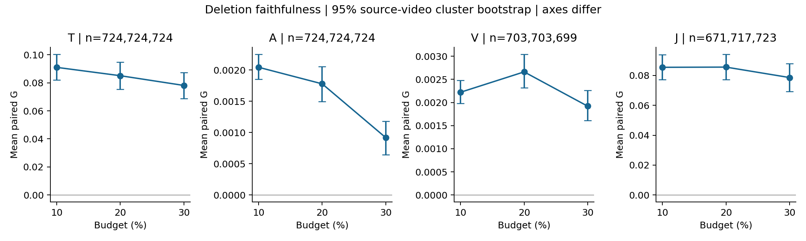
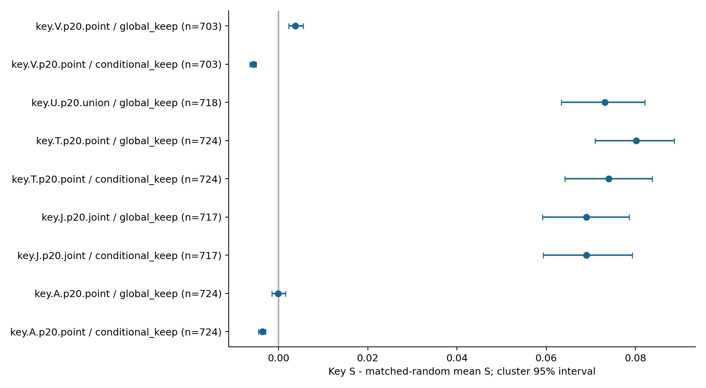
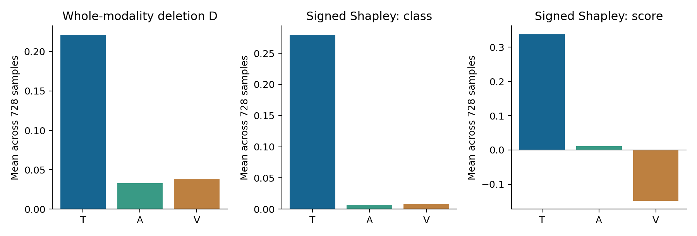

# Q3 迭代2实验报告

全量 valid 为开发评价；原预测器、遮蔽规则、20%主预算和最多3段均保持原方法。附件4无标签，不能报告专项准确率。旧运行目录保留，新结果位于 valid_v2 / special_v2。

原样预测：n=728，Accuracy=0.615385，Macro-F1=0.577807，Weighted-F1=0.605695，MAE=0.641531，Pearson=0.608243。
有效来源视频簇：239。全部标签仅进入评价，未进入归因或选段。

## 严格匹配后的忠实性

G = D(关键集合) − 匹配随机集合平均 D。每个随机集合保持官方片段长度多重集合、完整单元和三路成本，排除目标。置信区间以 video_id 为整簇抽样，簇内保留所有片段后计算样本均值。少于20个随机集合仍可计算描述均值，但不能支持精细尾部判断。

| 实验 | 完整/计划 | 可比较 | 无对照 | mean G | median G | G>0 | 95% CI |
|---|---:|---:|---:|---:|---:|---:|---|
| key.A.p10.point | 728/728 | 724 | 4 | 0.002045 | 0.001664 | 0.790 | [0.001854, 0.002256] |
| key.A.p20.block3 | 728/728 | 538 | 190 | 0.002047 | 0.001740 | 0.742 | [0.001746, 0.002351] |
| key.A.p20.point | 728/728 | 724 | 4 | 0.001780 | 0.001023 | 0.673 | [0.001498, 0.002054] |
| key.A.p20.point.cost3 | 21/21 | 21 | 0 | 0.001289 | 0.000441 | 0.667 | [0.000379, 0.002348] |
| key.A.p20.point.cost6 | 9/9 | 9 | 0 | 0.000636 | -0.000660 | 0.333 | [-0.000992, 0.002635] |
| key.A.p30.point | 728/728 | 724 | 4 | 0.000918 | 0.000308 | 0.550 | [0.000644, 0.001182] |
| key.J.p10.joint | 728/728 | 671 | 57 | 0.085455 | 0.057764 | 0.906 | [0.077315, 0.093984] |
| key.J.p20.joint | 728/728 | 717 | 11 | 0.085587 | 0.053767 | 0.813 | [0.077145, 0.094277] |
| key.J.p30.joint | 728/728 | 723 | 5 | 0.078594 | 0.049082 | 0.766 | [0.069367, 0.087839] |
| key.T.p10.point | 728/728 | 724 | 4 | 0.091006 | 0.061387 | 0.874 | [0.081982, 0.100452] |
| key.T.p20.block3 | 728/728 | 531 | 197 | 0.072292 | 0.044766 | 0.872 | [0.063718, 0.080662] |
| key.T.p20.point | 728/728 | 724 | 4 | 0.085062 | 0.055142 | 0.805 | [0.075322, 0.094628] |
| key.T.p20.point.cost3 | 21/21 | 21 | 0 | 0.049492 | 0.032328 | 0.762 | [0.021835, 0.080425] |
| key.T.p20.point.cost6 | 9/9 | 9 | 0 | 0.109687 | 0.025736 | 0.778 | [0.020595, 0.219201] |
| key.T.p20.word | 728/728 | 719 | 9 | 0.082109 | 0.054582 | 0.784 | [0.072805, 0.091061] |
| key.T.p30.point | 728/728 | 724 | 4 | 0.078115 | 0.049316 | 0.764 | [0.068630, 0.087437] |
| key.V.p10.point | 713/728 | 703 | 10 | 0.002222 | 0.001430 | 0.876 | [0.001982, 0.002484] |
| key.V.p20.block3 | 713/728 | 505 | 208 | 0.002146 | 0.001190 | 0.778 | [0.001803, 0.002486] |
| key.V.p20.point | 713/728 | 703 | 10 | 0.002663 | 0.001258 | 0.791 | [0.002317, 0.003047] |
| key.V.p20.point.cost3 | 19/19 | 19 | 0 | 0.001798 | 0.000784 | 0.842 | [0.000786, 0.002776] |
| key.V.p20.point.cost6 | 8/8 | 8 | 0 | 0.005173 | 0.002863 | 0.875 | [0.001942, 0.009647] |
| key.V.p30.point | 713/728 | 699 | 14 | 0.001921 | 0.000698 | 0.657 | [0.001612, 0.002263] |

文本与联合路径有稳定的正平均增益；A/V 的绝对增益明显较小。95%区间不跨0不等于人类情绪解释准确，也不保证每条样本有效。小样本同成本子组的区间应与有效样本数一起阅读。

## 保留、低影响与粒度

保留定义 S=1−D。global_keep 删除全输入集合外内容；conditional_keep 仅删除对应模态域的其余内容。以下均为同样本配对，不把不同成本直接比较。

| 比较 | n | 配对平均差 | 95% CI |
|---|---:|---:|---|
| key D − low D：key.A.p10.point | 728 | 0.003369 | [0.003165, 0.003593] |
| key D − low D：key.A.p20.point | 728 | 0.003705 | [0.003417, 0.004025] |
| key D − low D：key.A.p30.point | 728 | 0.003195 | [0.002891, 0.003494] |
| key D − low D：key.T.p10.point | 728 | 0.114987 | [0.104979, 0.126163] |
| key D − low D：key.T.p20.point | 728 | 0.120010 | [0.109757, 0.130267] |
| key D − low D：key.T.p30.point | 728 | 0.120060 | [0.109087, 0.131249] |
| key D − low D：key.V.p10.point | 713 | 0.003141 | [0.002871, 0.003479] |
| key D − low D：key.V.p20.point | 713 | 0.004050 | [0.003599, 0.004497] |
| key D − low D：key.V.p30.point | 713 | 0.003608 | [0.003185, 0.004018] |
| group D − 同成本point D：key.A.p20.block3 | 728 | 0.000115 | [-0.000221, 0.000452] |
| group D − 同成本point D：key.T.p20.block3 | 728 | -0.036871 | [-0.045926, -0.028203] |
| group D − 同成本point D：key.T.p20.word | 728 | 0.001135 | [-0.003687, 0.005843] |
| group D − 同成本point D：key.V.p20.block3 | 713 | -0.000804 | [-0.001078, -0.000530] |

整词和3位置分块以组为完整单元先做真实联合遮蔽；预算取不超过目标的最大可达成本。同成本 point 对照随实际成本重选。block3 为固定不重叠的官方索引块，只是粒度敏感性，不能叫音视频复制组或真实时间片。分组 Jaccard、成本一致性与各样本数见 granularity.json。

## 方向与双输出

valid 方向候选 4368 个，重测 4310 个，保持 4301 个，失败 9 个，不适用 58 个。全部失败记录保留在 direction.json。
专项09、18号的文本 suppress 候选方向反转；14号分类首位V、强度首位T；13号视觉无观测。卡片保留这些反例。

## 中性类与错误预测分层

| 路径 / 分层 | 可比较 n | mean G | G>0 |
|---|---:|---:|---:|
| key.A.p20.point / original_correct | 444 | 0.001678 | 0.673 |
| key.A.p20.point / original_wrong | 280 | 0.001941 | 0.671 |
| key.A.p20.point / true_neutral | 181 | 0.002183 | 0.691 |
| key.J.p20.joint / original_correct | 440 | 0.094433 | 0.841 |
| key.J.p20.joint / original_wrong | 277 | 0.071535 | 0.769 |
| key.J.p20.joint / true_neutral | 178 | 0.061026 | 0.764 |
| key.T.p20.point / original_correct | 444 | 0.093554 | 0.824 |
| key.T.p20.point / original_wrong | 280 | 0.071595 | 0.775 |
| key.T.p20.point / true_neutral | 181 | 0.064898 | 0.785 |
| key.T.p20.word / original_correct | 441 | 0.090231 | 0.823 |
| key.T.p20.word / original_wrong | 278 | 0.069223 | 0.723 |
| key.T.p20.word / true_neutral | 179 | 0.058890 | 0.749 |
| key.V.p20.point / original_correct | 429 | 0.002620 | 0.811 |
| key.V.p20.point / original_wrong | 274 | 0.002729 | 0.759 |
| key.V.p20.point / true_neutral | 175 | 0.003028 | 0.783 |

## 干预后的任务表现

每个随机重复先在同一可比较样本集合上计算任务指标，再对指标取平均；没有把平均概率当作一次随机模型输出。随机集合不足50时循环其随机排列，重复范围仅是描述变化，不是独立置信区间。

| 路径 | n | clean F1 | key F1 | random mean F1 | clean MAE | key MAE | random mean MAE |
|---|---:|---:|---:|---:|---:|---:|---:|
| key.T.p20.point | 724 | 0.57377 | 0.50692 | 0.56026 | 0.64421 | 0.71673 | 0.65670 |
| key.T.p20.word | 719 | 0.57392 | 0.50192 | 0.55944 | 0.64324 | 0.72849 | 0.65576 |
| key.A.p20.point | 724 | 0.57377 | 0.57364 | 0.57294 | 0.64421 | 0.64328 | 0.64463 |
| key.V.p20.point | 703 | 0.57030 | 0.56872 | 0.56965 | 0.64939 | 0.64940 | 0.64934 |
| key.J.p20.joint | 717 | 0.57352 | 0.50061 | 0.55779 | 0.64179 | 0.71456 | 0.65465 |

## 素材核验与结论边界

20条专项均可回到实际遮蔽的原文字符；CTC共有479个词时候选，其中14个被算法拒绝。边界与媒体时钟可机械检查，但尚无逐词听审确认。官方A/V特征行生成来源仍unresolved，不能按位置比例伪造时间。逐词播放页及真实PTS参考帧位于 outputs_v2/assets；参考帧只是素材上下文。

修正后的文本/联合解释具有可用的模型忠实性证据，但A/V效果较弱，功能词或标点仍可能成为高影响集合。计算结果完整不等于素材证据链完整，也不等于模型预测已达到很高准确率。无需用改变主要模态、删除失败案例或重训Q2来美化这些结论。

可复算材料：runs/valid_v2/summaries 下的 JSON 与 paired_samples.csv；全部逐视图/逐实验明细保留在服务器。验证报告与预测重算记录独立保存。
