# E题 Q1 多模态特征构建方法（v3 审核稿）

> 2026-09-23。本文只确定**方法、数学定义、数据边界和验证依据**，供审核；尚未实施特征提取、训练或专项预测。具体代码改造、环境配置、运行命令与实施排期，在本稿审核通过后另写。
>
> 审核建议：先看第2节的6张流程图，再看第3节的代码核查、第5—7节的特征与对齐定义，以及第9节的三问闭环。v2 原稿保留，便于对照。

## 1. 本稿建议采用的方法及主要修订

**主方法：以当前视频片段内的真实时间为公共坐标，利用已有转写进行词级强制对齐，提取 BERT 语义、eGeMAPSv02 帧级声学与 OpenFace 面部行为特征，再按时间重叠加权聚合为50个相对时间窗，同时输出观测掩码、覆盖率和来源映射。**

Q1的50个位置是等分整个片段的**时间窗**，附件2对齐版的50个位置是官方提供的**序列位置**。两者仅存储长度相同，不能视为同一坐标，也不能直接交换特征或模型权重。三问通过“带来源的时序表示—缺失处理—证据回溯与干预”衔接；附件2/3/4保留自身位置定义。

| 审核项 | v3 的明确选择 | 依据或取舍 |
| --- | --- | --- |
| Q1任务 | 100条样本的三模态时序特征及完整对应记录 | 不训练Q1情感预测器，不使用标签决定特征、时间边界或质量筛选 |
| 文本 | 冻结的 `bert-base-uncased`，末层子词表示先汇成词表示，768维 | 利用完整上下文，保留原文字符、词、子词映射；不先截成50词元 |
| 音频 | `eGeMAPSv02 + LowLevelDescriptors`，25维 | 帧级表示；默认单模态配置的88维 `Functionals` 不适合本流程 |
| 视觉 | OpenFace：17个AU强度、3个头部旋转角、2个视线角，22维 | 显式命名且紧凑；不把检测置信度、脸部平移和原始坐标混成情感特征 |
| 时间组织 | 原生变长序列保留作本地核验；正式Q1输出为50窗 | 覆盖整段视频及无词的声音/画面；不是新的可学习对齐算法 |
| 聚合 | 先排除不可用观测，再按与目标窗的重叠时长求均值 | 无可训练参数；另外记录覆盖率，避免少数有效帧冒充整窗完整 |
| 复用方式 | 复用 MMSA-FET 提取器和现有 CTC 对齐核心，增加薄适配层 | 本地批处理代码和时间/质量信息保存存在缺口，不能称为直接运行即可 |
| Q2/Q3入口 | 优先采用官方对齐版；统一 `text_bert → 兼容文本编码器` | 附件3对齐版没有预计算 `text`，从方法阶段解决入口不一致 |
| 闭环边界 | 共享状态语义、对齐方法、预测主干和验证操作 | 不声称已把Q1自提取特征输入Q2训练好的权重 |

相对v2的重要修正：现有仓库**已有强制对齐**；其实际核心是 ESPnet ASR 编码器的 CTC 输出与 `ctc_segmentation`，不能照README简称认定为 wav2vec 对齐器；“按时长等分50窗”改称**相对时间分箱**，不再将其包装成内容自适应对齐；`perturb_mask` 明确定义为1表示人为遮蔽；Q3能否回到秒级证据，增加了官方位置映射的独立核验条件。

## 2. 方法流程图：用于优先审核

图中 **R=复用已有计算核心，A=改造现有封装，N=本题新增组织方法**。R不表示整个入口无需改动。实线是本图内的数据或计算依赖；图5虚线表示方法继承或开发反馈，不表示把Q1的100条数据加入Q2训练。每图提供可直接阅读的图片与折叠的Mermaid源码；需要查看细节时可打开原图。

### 图1 Q1总流程：三个分支、一个时间坐标、全样本输出

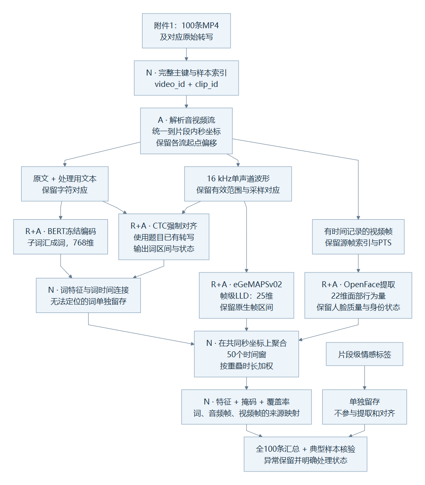

展开图1的 Mermaid 源码

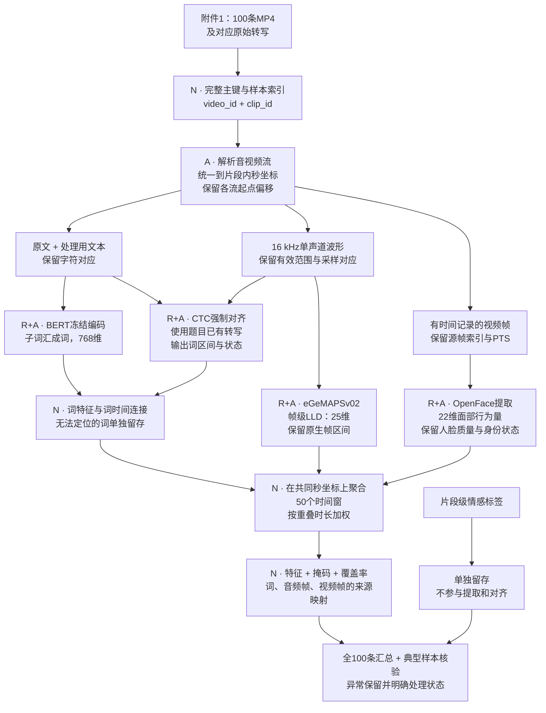

音频、视觉提取不必等待文本对齐成功；某个词对齐失败也不应使整条音视频分支失效。图1中Q1主输出只使用已成功建立时间对应的文本，未定位词仍保存在来源记录中。

### 图2 文本分支：原文—词—子词—秒，避免两套分词错位

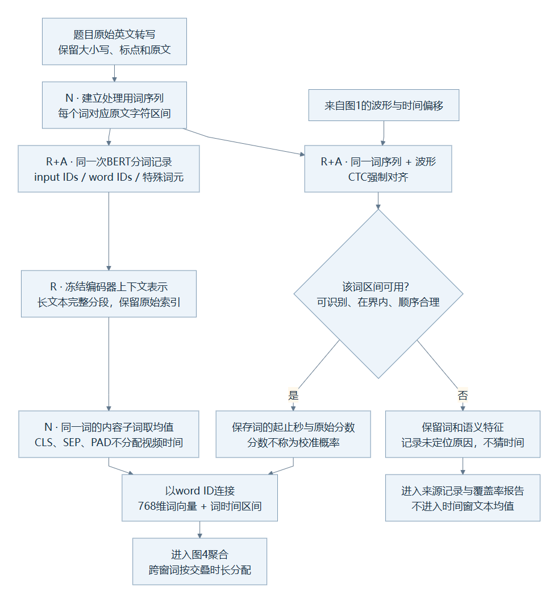

展开图2的 Mermaid 源码

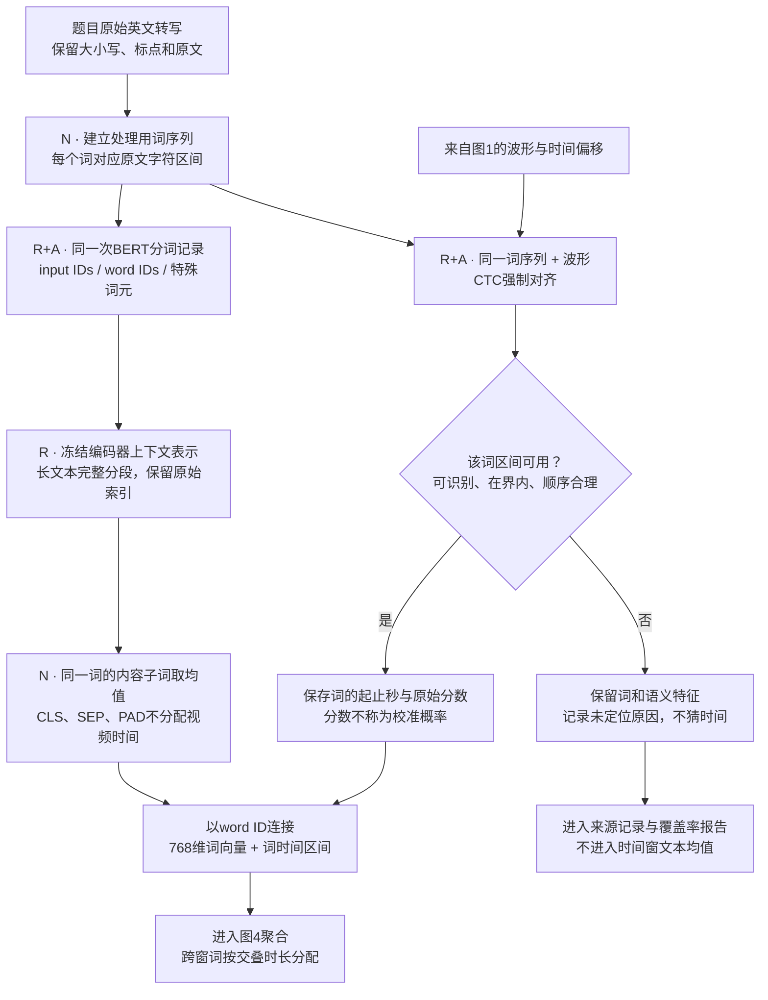

同一词被分成多个子词时，先在词内平均，再按词时间聚合。这样不会因为一个词被分成3个子词，就在同一时间段获得3倍权重。**这些768维向量仍是上下文表示，时间锚点不意味着其信息只来自该时段。**

### 图3 音视频分支：成功观测、静音、无人脸与身份不确定分开处理

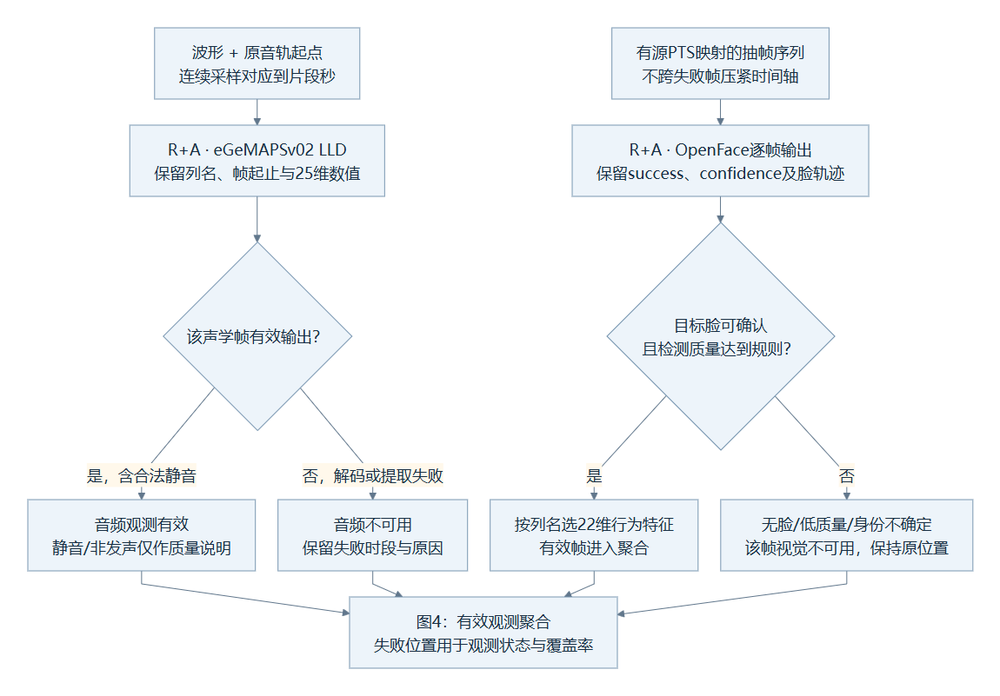

展开图3的 Mermaid 源码

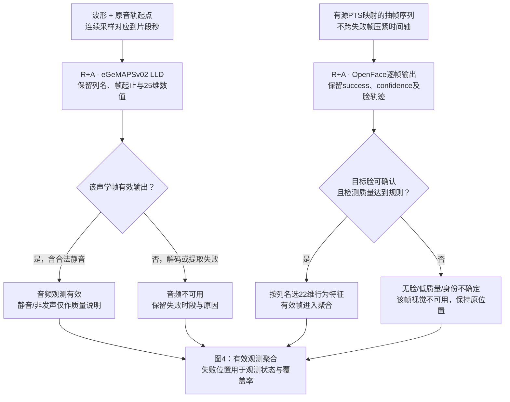

“检测到人脸”不等于“检测到当前说话人”。单人连续镜头可直接使用该轨迹；多脸或切镜头时需要确认目标说话人。仓库的 TalkNet/ASD 仅为候选辅助，尚不能把其裁剪序列默认视为保留了完整源时间轴。

### 图4 聚合细节：先确定真实区间，再分状态与权重

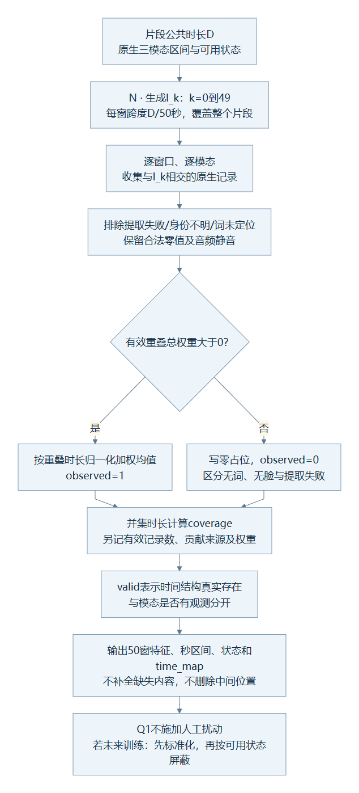

展开图4的 Mermaid 源码

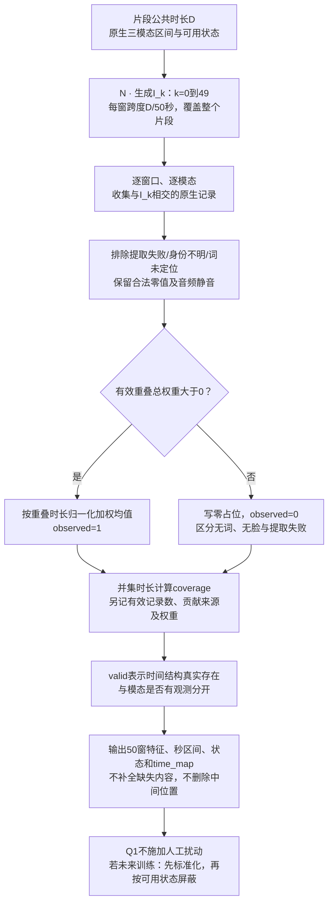

通常Q1的50个窗均属于真实片段，因此 `valid_mask` 全为1；窗口没有文本或人脸不构成padding。只有连时长/片段结构都无法建立时，才能把整条记录标为处理失败，并将其与成功提取结果分开报告。

### 图5 Q1—Q2—Q3闭环：方法继承与数据流分别标注

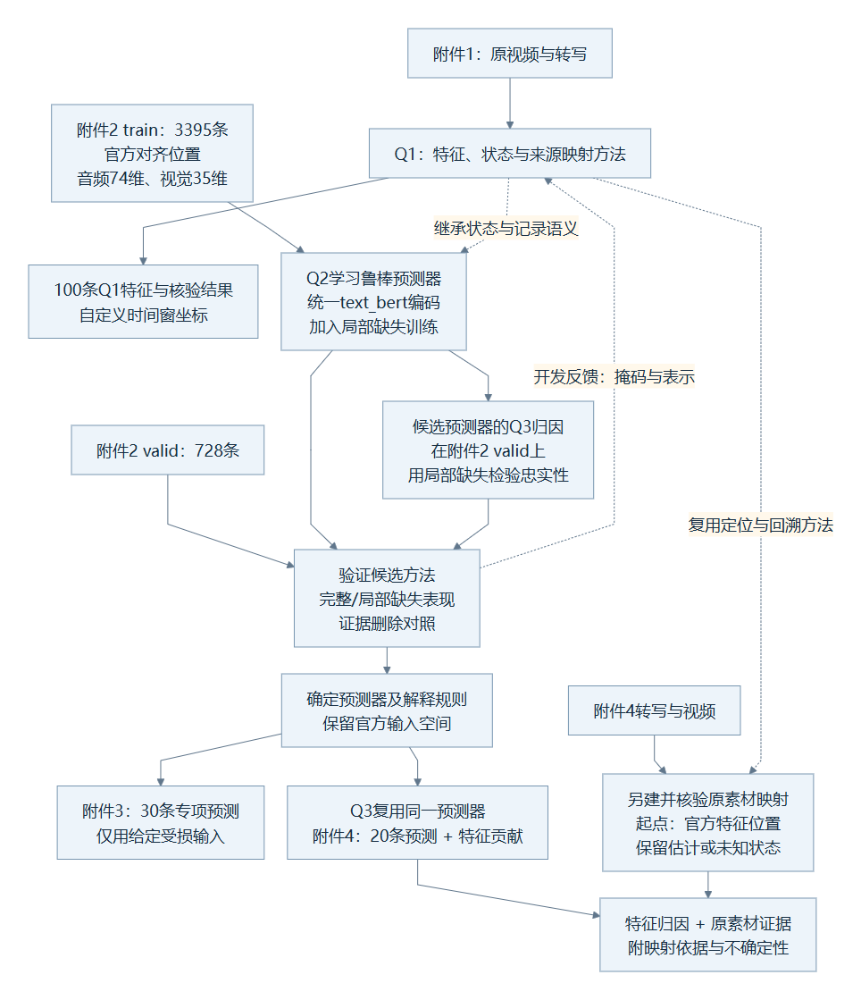

展开图5的 Mermaid 源码

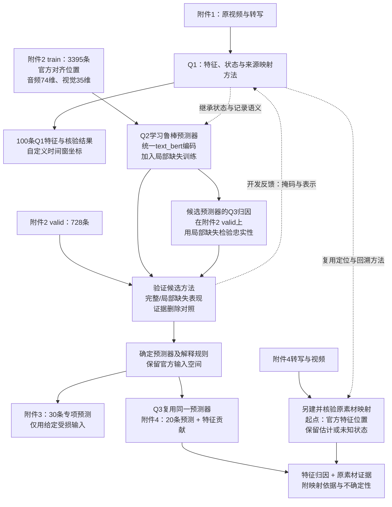

图5的循环发生在开发/验证阶段：根据验证集检验方法，再确定最终规则。附件3/4的专项输出不反向进入模型选择。附件2 `test` 共727条，可在方法确定后做一次补充留出评价。

### 图6 Q3回溯判断：有视频仍需证明“官方第k行”对应哪里

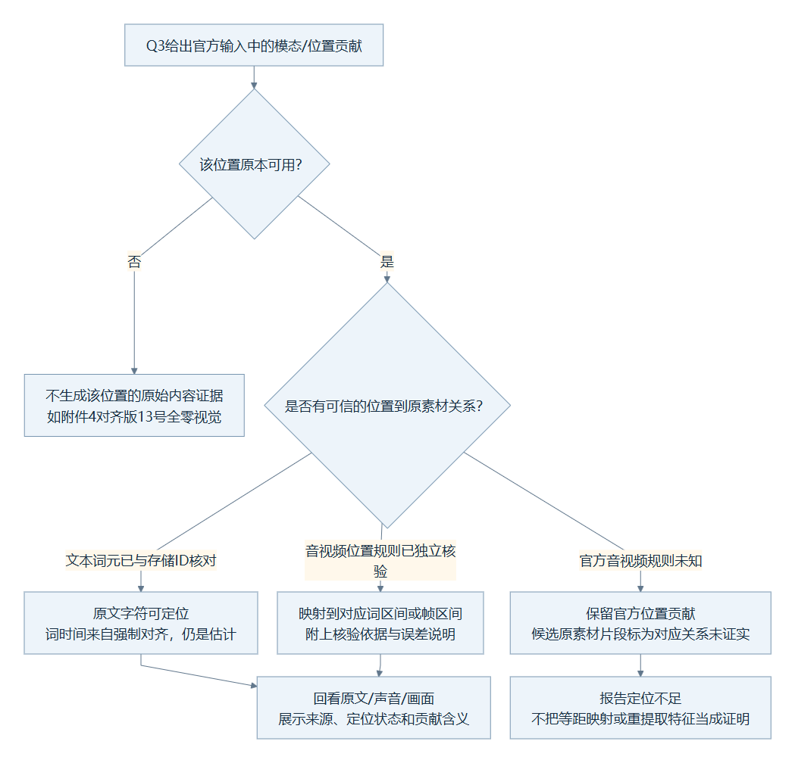

展开图6的 Mermaid 源码

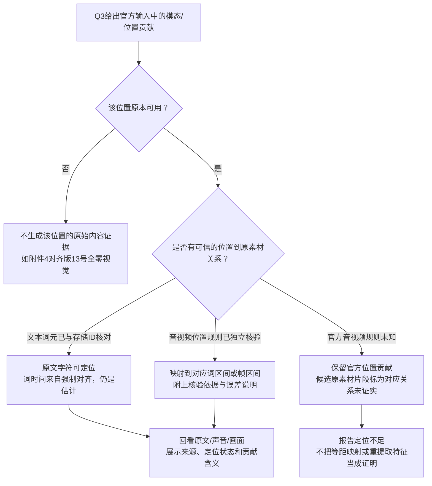

图6解决一个实际限制：**重新获得词时间戳，只证明这些词出现在视频的什么时间；它本身不能证明官方音频/视觉特征的第k行来自那个词。** 未核验的时间定位仍是Q3后续需要解决的问题，不能在Q1方法中提前宣布完成。

## 3. MMSA-FET实际代码核查与复用边界

本地目录为 `C:/Users/30738/Desktop/sm/中文题目/MMSA-FET`；`setup.cfg` 声明版本0.4.2，本地副本没有 `.git` 信息。本节结论来自该副本静态阅读，**不代表当前环境已安装全部依赖或跑通提取**。v2的“已跑通”在本轮没有运行证据，不再作为方法成立的前提。

| 模块与代码位置 | 实际已有能力或问题 | 对本方法的决定 |
| --- | --- | --- |
| [aligner/default.py:20](C:/Users/30738/Desktop/sm/中文题目/MMSA-FET/src/MSA_FET/aligner/default.py:20) | 下载/加载ESPnet模型，计算CTC概率，再对给定文本分段；`align()`返回词、start、end、conf | R+A：保留强制对齐核心，补词/字符映射、不可定位状态和公共时间偏移；不是从零新增对齐器 |
| [single.py:181](C:/Users/30738/Desktop/sm/中文题目/MMSA-FET/src/MSA_FET/single.py:181) | 已按词起止搜索音视频时间点并求均值，再按BERT的 `word_ids` 复制给子词；特殊词元补零 | 不直接用作本稿50窗聚合；借用词—子词映射思路，另建真实区间加权。原代码对空切片直接求均值，不能作为可用观测 |
| [text/bert.py:25](C:/Users/30738/Desktop/sm/中文题目/MMSA-FET/src/MSA_FET/extractors/text/bert.py:25) | 已有BERT编码、tokenize和word IDs；编码与word映射分别分词，`extract()`没有保存字符offset或明确长文本策略 | R+A：一次分词记录贯穿编码与对齐；保留768维末层表示，补长文本和特殊词元规则 |
| [audio/opensmile.py:24](C:/Users/30738/Desktop/sm/中文题目/MMSA-FET/src/MSA_FET/extractors/audio/opensmile.py:24) | 已保留原始DataFrame时间索引；`get_timestamps()`只给区间中点；可读特征名 | R+A：保留每帧起止及列名，不能只消费中点 |
| [opensmile.json](C:/Users/30738/Desktop/sm/中文题目/MMSA-FET/src/MSA_FET/example_configs/opensmile.json) 与 [aligned.json](C:/Users/30738/Desktop/sm/中文题目/MMSA-FET/src/MSA_FET/example_configs/aligned.json) | 前者是 `Functionals`；后者才是 `LowLevelDescriptors`。后者视觉配置未开启pose/gaze | 不能只说“调用默认OpenSMILE/OpenFace”；方法指定LLD，以及AU、pose、gaze三类输出 |
| [video/openface.py:66](C:/Users/30738/Desktop/sm/中文题目/MMSA-FET/src/MSA_FET/extractors/video/openface.py:66) | `df.columns[5:]`按位置切列，未保存质量列；可按 `average_over` 先平均；时间戳用帧数/FPS生成；特征名方法未实现 | R+A：按列名选择行为量，先保存源帧/质量，再聚合；提取阶段 `average_over=1`。预平均后再沿未平均的时间轴索引会错位 |
| [utils.py:73](C:/Users/30738/Desktop/sm/中文题目/MMSA-FET/src/MSA_FET/utils.py:73) | FFmpeg可抽音轨和按FPS抽图，但返回结果不包含源帧PTS与音视频起点对应 | A：保留解码能力，补原视频时间与派生信号时间关系，不能将BMP序号冒充原帧索引 |
| [dataset.py:71](C:/Users/30738/Desktop/sm/中文题目/MMSA-FET/src/MSA_FET/dataset.py:71) | 批处理期待 `Raw/`、`label.csv`、`mode`及单模态标签列，附件1不满足；异常样本进入错误表并从主结果跳过 | N+A：使用附件1样本索引和逐样本组织；100条记录全部保留，不伪造train/valid/test及单模态标签 |
| [dataset.py:118](C:/Users/30738/Desktop/sm/中文题目/MMSA-FET/src/MSA_FET/dataset.py:118) 与 [dataset.py:400](C:/Users/30738/Desktop/sm/中文题目/MMSA-FET/src/MSA_FET/dataset.py:400) | 批处理调用 `align_with_transcript`，但本地Aligner提供的是 `align`；还把Aligner当映射索引，并期待示例中不存在的 `align.tool` | 原批量入口不能标为“直接复用”。以单样本提取组织和底层提取器为基础，实施时解决接口差异 |
| [dataset.py:247](C:/Users/30738/Desktop/sm/中文题目/MMSA-FET/src/MSA_FET/dataset.py:247) | 长序列直接取前缀；批长度使用均值加3倍标准差，不是固定50 | 不沿用默认padding作为时序对齐；由本文明确的50窗聚合生成结果 |

因此，方法的可复用核心是**BERT、openSMILE、OpenFace和CTC对齐能力**；本题新增的是有完整状态和来源关系的组织层。无需重搭提取工具，但也不能只转换一个Excel或修改一个配置文件就宣称完成Q1。

## 4. 题目、已知数据与方法假设

### 4.1 题目要求及本轮依据

已核对题目DOCX的Q1—Q3要求、数据使用规范和50 MB提交约束；数值统计沿用已完成的[数据核查总结](C:/Users/30738/Desktop/sm/中文题目/E题/doc/E题数据细节与方法实现规划说明.md)，本轮没有重新加载大型PKL或遍历原视频。

| 已知条件 | 对Q1方法的约束 |
| --- | --- |
| 附件1：37个来源、100个片段，2.648—34.567秒；提供转写及片段标签 | 主键用 `(video_id, clip_id)`；不重新ASR替换原文；不丢弃异常样本 |
| 没有逐词时间戳、抽帧表和独立音频 | 需要自己建立并保存时间关系 |
| Q1未规定50步或768/74/35维 | 时间长度和维度由本方法定义，并说明损失与优点 |
| 附件1与附件2重合18条：train 11、test 7、valid 0，其余82条不在附件2 | 附件1整体不能加入Q2/Q3训练或调参；本稿不使用这18条学习跨空间映射 |
| 附件3对齐版仅有 `text_bert/audio/vision`，没有 `text` | Q2/Q3统一文本入口，避免训练与推理一端预计算、一端临时换编码器 |
| 附件2/4文本padding向量并非全零；附件2对齐版train有110条全零视觉 | 文本有效性看真实注意力掩码；全零视觉要保留并明确缺乏视觉内容 |
| 附件4对齐版13号视觉全零；官方特征无秒级时间表 | Q3不能凭视频存在就宣称预测器使用了其中的视觉内容 |
| 附件2未对齐版视觉长度在train/valid/test有618/141/131条冲突 | 首选对齐版有接口理由，但不是性能保证；换版本须重新解决长度语义 |

### 4.2 假设及不成立时的处理

1. 题目转写基本对应当前视频中可听见的语言。强制对齐用于定位而非修订转写；不匹配的词保留为未定位，报告文本时间覆盖不足。
2. 英文语义可由固定预训练BERT表征；声学和脸部行为提供互补线索。它们是情感相关输入，不等于情感标签或确定的情绪含义。
3. 视频以可识别的目标说话人为主。多脸、旁白或目标切换不满足这一条件时，记录身份不确定，不能自动把最大人脸当作说话人。
4. 50窗对本题片段具有可接受的紧凑性。每窗约0.053—0.691秒，长片段可能混合多个短词或瞬时表情；这是待核验的分辨率选择，不是已证明的最优长度。

允许直接使用预训练提取器；不引入其他情感数据集做训练、微调或阈值选择。Q1各提取器冻结，标签单独存放。检测质量规则和人工时间核验不以片段正负标签为依据。

## 5. 三模态特征的具体定义

### 5.1 公共时间与来源坐标

令片段时间范围为 `[0,D]`，0是当前MP4片段的公共回放起点，不是原长视频的绝对起点。音频流、视频流的起始偏移分别为 `δ_A`、`δ_V`。在某派生信号中测得的局部时间 `u`，需通过保存的变换得到公共时间，例如音频为 `t=u+δ_A`。

音频供BERT时间定位与声学提取使用的工作波形统一为16 kHz单声道，记录下混和重采样方式；采样序号 `n` 对应 `δ_A+n/16000`。不按样本响度统一缩放整段音量，以免抹去响度相关线索。音轨不足视频时长的部分标记不可观测，不拉伸音频凑满。

视觉主方案以25 Hz为目标抽样频率，保留抽样时刻、源帧索引及源PTS；原视频低于该频率时不把复制帧算成新的独立观测。抽帧率是工作参数，原视频真实FPS另记。对可变帧率视频，以源PTS定位；不能用 `frame_index / nominal_fps` 替代实际时间记录。

### 5.2 文本：有词时间锚点的上下文语义

设处理用词序列为 `w_1,…,w_J`。保留原文与处理用文本的字符对应，不改变原始附件；空白规范化、对齐器所需大小写转换等都只作用于派生输入。BERT分词与CTC词序列必须指向同一组word IDs。

固定 `bert-base-uncased` 与对应快速分词器，取最后隐藏层。令 `B_j` 是第j个词的内容子词集合，词向量为：

\[
h_j=\frac{1}{|B_j|}\sum_{r\in B_j}\operatorname{BERT}(text)_r,
\qquad h_j\in\mathbb R^{768}.
\]

词的对应区间由CTC估计为 `τ_j=[s_j,e_j)`。不把每个子词人为均分成独立发音区间；子词共享父词来源，供索引追踪。快速分词器支持字符offset等映射信息，但预分词输入的局部offset需结合父词原文起点使用，不能误当全文坐标。[Hugging Face分词器文档](https://huggingface.co/docs/transformers/main_classes/tokenizer)

具体规则：

- `CLS/SEP/PAD`不进入词向量均值或时间聚合；独立标点不创建虚构发音区间，按有记录的规则附着相邻词。
- 提取时采用推理状态和关闭梯度，模型不以这100条标签微调。编码器上下文长度与最终50窗是两件事。
- 超过编码器容纳长度时，按连续文本分段、保留重叠与原索引，同一子词多次出现的表示先合并；不得直接删去第50词元以后的内容。分段参数在后续实施方案明确。
- CTC的 `conf` 是原工具分段分数的指数变换，不能直接写成“该词对齐正确的概率”。报告原始分数与人工核验结果。
- 未知词、明显错序、零/负时长、明显越界和低可信区间进入异常记录。只允许对时间量化造成的微小边界误差作有记录的修正，不用均匀分配时间填补失败词。
- 若全部词无法定位，仍保存词语义序列，但50窗文本观测不可用；音频和视觉继续提取。不得把这种结果称为三模态全部提取成功。

### 5.3 音频：25维帧级声学描述量

选择 `openSMILE eGeMAPSv02 / LowLevelDescriptors`，得到 `X_A∈R^(L_A×25)`。其设计覆盖基频、响度、频谱及声音质量等描述量；最终逐维名称和单位随所用版本从工具输出保存，不臆造官方74维的对应关系。官方接口区分25维LLD与88维Functionals。[openSMILE特征集合说明](https://audeering.github.io/opensmile-python/)

每个声学帧记录数值、原生起止秒 `τ_i^A`、提取成功状态。即使多个原生分析窗彼此重叠，也保留真实分析窗，不假设每行就是固定10毫秒的互不重叠区间；实际帧移、分析窗和内部平滑配置随版本记录。

静音可以是有效的声学观测。无基频或某些描述量为零，不等于整帧缺失；合法的工具输出按原语义保留。解码失败或无法形成完整有效特征的帧另记不可用。Q1不做降噪重建或情感驱动的声学筛选，避免改变原信号再把变化当成数据事实。

### 5.4 视觉：22维面部行为描述量

OpenFace输出按列名选择以下紧凑集合：

| 组别 | 明确选择 | 维数 | 意义与限制 |
| --- | --- | ---: | --- |
| AU强度 | `AU01_r, AU02_r, AU04_r, AU05_r, AU06_r, AU07_r, AU09_r, AU10_r, AU12_r, AU14_r, AU15_r, AU17_r, AU20_r, AU23_r, AU25_r, AU26_r, AU45_r` | 17 | 连续肌肉动作强度；不把AU直接翻译成正负情感 |
| 头部旋转 | `pose_Rx, pose_Ry, pose_Rz` | 3 | 弧度，反映头部姿态；不使用平移作为主特征 |
| 视线方向 | `gaze_angle_x, gaze_angle_y` | 2 | 弧度，描述视线方向；需工具版本实际支持并输出 |
| 合计 | 上述列按固定顺序连接 | 22 | Q1自定义特征空间，不是附件2的35维复现 |

AU强度 `_r` 与是否出现 `_c` 是不同输出，本稿不混用。检测的 `success/confidence`、帧号、时间与目标身份只用于质量及来源记录，不作为这22维中的情感输入。[OpenFace AU说明](https://github.com/TadasBaltrusaitis/OpenFace/wiki/Action-Units)、[输出格式说明](https://github.com/TadasBaltrusaitis/OpenFace/wiki/Output-Format)

17个AU和2个视线角是**拟采用工具版本应提供的列**，不是当前已经得到的运行结果；实施阶段若本机二进制字段不同，应明确更换到支持该集合的版本或回报方法变更，不能无说明地用第5列之后的所有字段代替。保留关键点作人脸质量/可视化辅助即可，不增加到主特征中。

视觉质量规则为：目标轨迹可确认、检测成功、置信度达到预先声明的工作阈值，且所需列均为有效数值。置信度阈值与多脸处理规则以无标签的抽样回看确定，报告阈值敏感性，不以情感分类分数挑选。阈值数值留给实施前的小规模质量核验，不宣称已经校准。

源视频每帧有持续区间，抽样帧的代表区间由实际抽样时间及相邻源帧关系确定。若使用抽样邻域近似其代表范围，应限制在相邻计划抽样位置内，并标注为采样近似；失败帧和长缺口不能被前一张成功人脸无限延展覆盖。保留原始角度，跨越角度周期边界时先作周期一致处理再求均值，避免正负π附近的均值误落到0。

OpenFace的视频/图像序列模式可能包含整段的人脸校准。这类输出及BERT特征都有上下文依赖，原素材锚点仅说明表示所附着的位置，不能据此证明局部干预具有因果独立性。

## 6. 跨模态时序组织与数学模型

### 6.1 为什么主输出采用50个相对时间窗

本稿保留v2的固定长度设计，但明确其用途是**全片段紧凑表示**：短片段与长片段都覆盖 `[0,D]`，保留停顿、叹息、笑声和无词画面，不为了最长序列截掉尾部。

词锚定序列更贴近MMSA-FET默认对齐逻辑，但不覆盖无词区间，子词重复还会改变音视频的计数权重；固定绝对长度窗口则会产生不同序列长度。本稿选择相对分箱并保留原生词/帧序列，作为当前审核主方案；它的代价是长片段时间分辨率较低、文本的词内顺序在单窗均值中被压缩。

“保留原生序列”指保留中间提取结果和索引供本地重算、审查，不要求把未压缩帧图、波形、每种候选特征都放入比赛提交包。正式提交必须完整包含100条选定方法的时序特征及必要映射。

### 6.2 公共窗口

令 `K=50`，数组位置从0开始：

\[
I_k=[kD/K,(k+1)D/K),\quad k=0,\ldots,K-1.
\]

最后一窗的右端记为D；持续时间按左闭右开区间计算。源时间点位于D时按边界规则归入最后可用帧记录，不创建第51个窗口。`I_k`是在当前片段内的秒坐标；`k/K`是相对位置，不是单词序号。

### 6.3 有效观测的时间重叠加权

对模态 `m∈{T,A,V}`，原生第i条记录为 `(x_i^m,τ_i^m,o_i^m)`，其中 `o_i^m∈{0,1}` 表示该记录是否满足该模态的可用规则。文本的原生记录是已对齐词，音频是声学帧，视觉是带时间映射的抽样帧。

定义重叠权重与其和：

\[
a_{ki}^m=o_i^m\,|I_k\cap\tau_i^m|,\qquad
S_k^m=\sum_i a_{ki}^m.
\]

聚合及窗口观测状态：

\[
z_k^m=
\begin{cases}
\displaystyle\sum_i\frac{a_{ki}^m}{S_k^m}x_i^m,&S_k^m>0,\\
\mathbf0,&S_k^m=0,
\end{cases}
\qquad O_k^m=\mathbb1[S_k^m>0].
\]

输出 `Z_T∈R^(50×768)`、`Z_A∈R^(50×25)`、`Z_V∈R^(50×22)`。这里三模态的第k行落在同一窗口，维度无需相同。Q1只做各模态内部的时间汇聚，不在这一步训练跨模态融合器。

另外记录时间覆盖率：

\[
C_k^m=\frac{\left|I_k\cap\bigcup_{i:o_i^m=1}\tau_i^m\right|}{|I_k|}.
\]

**覆盖率使用区间并集，不能用 `S_k^m/|I_k|` 替代。** 后者在声学分析窗重叠时可能大于1。前一公式是“描述量的重叠加权平均”，并不宣称对重叠帧做了统计独立性校正；不规则采样与重叠程度会影响权重，应在原生区间记录中可见。

`O=1`只说明有可用观测；`C=0.1`和`C=1`的充分程度不同。覆盖率及有效帧数作为质量信息供后续模型参考，不在Q1擅自把低覆盖率判成低情感置信度。视觉覆盖率还依赖抽样代表区间，是带采样假设的覆盖，不等于逐帧全部确认。

### 6.4 一个可手算的聚合示例

以下是规则示例，不是实际样本结果。设 `D=10秒`、`K=50`，则 `I_5=[1.0,1.2)`。两个已定位词区间分别为 `[0.9,1.1)`、`[1.1,1.3)`，其词向量是 `h_1,h_2`，则：

\[
z_5^T=(0.1h_1+0.1h_2)/0.2=0.5h_1+0.5h_2.
\]

若第一个词被BERT切成3个子词，先取这3个向量的词内均值，再参与上述计算，其时间权重仍是0.1秒。

该窗若音频提取正常但为静音，则 `V_5=1,O_5^A=1`；若没有有效目标人脸，则 `V_5=1,O_5^V=0`、视觉写零占位。它们不能共同标记为“padding”或“随机模态缺失”。

## 7. 掩码、缺失原因及数值处理

### 7.1 四类信息，各自只回答一个问题

| 记号/字段 | 形状 | 1或数值的含义 | Q1默认处理 |
| --- | --- | --- | --- |
| `V / valid_mask` | `(50,)` | 该时间位置确属片段结构 | 可确定时长且覆盖全片段时全1 |
| `O / observed_mask` | `(50,3)` | 当前模态在该窗有可用于聚合的观测 | 由提取与时间映射状态产生，不能从特征值是否为零推导 |
| `P / perturb_mask` | `(50,3)` | **1=后续实验人为遮蔽**，0=未遮蔽 | Q1不构造扰动，可省略或全0 |
| `C / coverage` | `(50,3)` | 有效时间覆盖比例，范围0—1 | 按第6节区间并集计算 |

后续实验的实际可用掩码定义为：

\[
U_k^m=V_k\,O_k^m(1-P_k^m).
\]

同一窗口可有多种不可用原因，在metadata记录：`no_aligned_word`、`alignment_failed`、`no_audio`、`decode_failed`、`no_face`、`low_face_quality`、`speaker_uncertain`等。不必为每种原因新增模型分支。

| 场景 | V | O | P | 解释 |
| --- | ---: | ---: | ---: | --- |
| 非零或合法零值观测 | 1 | 1 | 0 | 可使用 |
| 合法静音音频 | 1 | 1 | 0 | 不是声学丢失 |
| 无词时间段的文本窗 | 1 | 0 | 0 | 此窗无已定位文本；如对齐覆盖不足，不能断言就是静音 |
| 无有效目标人脸 | 1 | 0 | 0 | 原始视觉不可用 |
| 对原可用位置做人为遮蔽 | 1 | 1 | 1 | 已知模拟缺失 |
| 批处理padding | 0 | 0 | 0 | 不在真实结构中 |

### 7.2 标准化与失败处理

Q1保存可解释的原始提取量及统一 `float32` 时序矩阵，不在100条上拟合一个供Q2直接使用的全局标准化器。未来使用哪套特征训练，就在其**相应train的可用位置**估计标准化统计量；投影层及所有归一化偏置之后仍需确保缺失位置不能被当成内容证据。

先对有效观测标准化，再用U屏蔽占位值。不要让零占位经减均值后变成非零“观测”；也不要在计算均值/方差时把padding、已知失败和人工缺失混进去。BERT主表示不额外作逐样本去均值来抹去上下文差异。

局部失败保留其他有效部分；完全失败样本保留主键、原因与明确的失败记录。若交付中使用固定形状零占位，必须附 `processing_status=failed` 与不可用掩码。**100条记录覆盖率与100条成功提取率是两个指标，不能用零占位满足“全部成功”的表述。**

## 8. 输出内容、来源映射与体积

### 8.1 方法层面的输出定义

建议以每样本NPZ配合JSON元数据保存；本节仅规定应有内容，具体目录、接口和读写代码在实施方案中制定。

| 输出内容 | 形状/形式 | 必要说明 |
| --- | --- | --- |
| `text_features/audio_features/vision_features` | `(50,768)/(50,25)/(50,22)` | float32；不可用位置为零且必须搭配O |
| `time_intervals` | `(50,2)` | 秒，片段内公共坐标 |
| `valid_mask/observed_mask/coverage` | `(50,)/(50,3)/(50,3)` | 第7节语义 |
| `valid_length` | 标量 | `sum(V)`；不等于三模态共同有观测的窗口数 |
| `time_axis` | `relative_time_bins` | 与官方特征的序列轴明确区分 |
| 样本信息 | 主键、原文件、D、流参数、文本与标签旁表 | 输入标签与提取计算分离 |
| 特征定义 | 模型/分词器版本、层、列名、单位及顺序 | 不仅记录维数 |
| 来源记录 | 词/子词/字符区间，音频采样及分析帧区间，源视频帧与PTS | 局部索引不能省去所属样本与模态 |
| `time_map` | 每窗关联来源索引、重叠时长/权重及定位状态 | 能从窗口查原素材，也能从一个词/帧找到受影响的窗 |
| 质量与异常 | 对齐覆盖、人脸有效率、低覆盖窗数、未定位词、错误原因 | 记录分母和未知状态 |
| 提取配置与日志 | 软件版本、关键参数、采样/窗口/质量规则 | 以版本与配置说明复现，不另加内容哈希机制 |

原生来源表保存一次，窗口记录引用索引即可，不在每个窗口重复写整段文本和所有帧元信息。时间映射分清：源帧/采样关系来自解码记录；词起止是对齐估计；抽样帧代表区间可能是采样近似。

### 8.2 必须能够完成的双向追踪

正向：`原文字符 → word ID → 子词向量 → 词时间 → 涉及的窗口及权重`，以及 `源音频/视频记录 → 分析帧 → 窗口`。

反向：`样本 + 模态 + 窗口k → I_k → 参与聚合的词/帧、各自权重 → 可回看的原文/音频/视频`。反向结果是一组来源，不必强行返回一个“代表词”或单张“关键帧”。

BERT向量涉及上下文，反向映射证明的是**来源锚点和计算参与关系**，不能单凭映射声称某个词是模型预测的原因。Q3还需要固定预测器上的归因及干预实验。

### 8.3 全量汇总与提交体积

100条汇总至少给出主键、时长、各模态维度、50窗宽度、有效结构长度、三模态观测率、时间覆盖率、对齐词数/总词数、有效人脸帧数/抽样帧数、状态和异常说明。论文展示至少1个真实典型样本，另宜展示长片段与部分观测失败案例。

本稿主特征矩阵不压缩时大小为：

\[
100\times50\times(768+25+22)\times4
=16{,}300{,}000\ \text{bytes}\approx16.30\ \text{MB}.
\]

这只是三组矩阵的原始体积估算，不含映射、代码及Q2/Q3模型参数。压缩收益需实际测量；原生中间特征在本地保留并可由输入重算，正式提交的选定时序特征不能只交典型样本。采用冻结提取器有利于控制自训练参数量，但**题目尚未说明大型通用预训练权重是否可免于打包**，不能据此承诺总材料已满足50 MB。实施方案必须列出真实权重与文件预算，并解决提交口径。

## 9. Q1与Q2、Q3如何形成可验证的闭环

### 9.1 三问共享的内容及明确不等价的内容

| 项目 | Q1 | Q2/Q3官方对齐版 | 衔接方式 |
| --- | --- | --- | --- |
| 样本粒度 | 附件1片段主键 | 附件2完整ID；专项文件保留自身编号 | 保留来源命名空间，不把附件4的01当成MOSEI全局ID |
| 时间位置 | 等时长50窗 | 官方50个序列位置 | 共同保存索引和位置类型；不共享k对应秒的公式 |
| 文本 | 完整上下文编码后按词/时间窗聚合 | 存储的 `text_bert` 经同一兼容编码器得到词元序列 | 可复用模型家族及词元映射方法；窗口表示和词元表示仍不同 |
| 音频/视觉 | 25/22维有命名物理或行为量 | 74/35维官方向量，逐维含义未证实 | 复用模态编码结构思想，分别设置输入层；不直接复用权重 |
| 观测状态 | 提取日志可知或可判定 | 部分仅能从输入零行及结构规则推定 | 共享字段语义，另记来源是known还是inferred |
| 原素材时间映射 | 提取时保存 | 附件2/3未知；附件4须另建并核验 | 复用定位过程，不复制Q1数值映射 |
| 预测与解释 | 不训练预测器 | Q2预测主干供Q3复用 | 对同一决策过程进行解释及缺失干预 |

共同投影到某隐藏维度d，只是可采用相同后续计算结构，不会让不同来源的输入空间自动相同。本方案的闭环是**方法与验证闭环**；在特征兼容性未证实之前，不声称已经形成Q1→Q2权重→Q3的原始信号端到端预测系统。

### 9.2 对Q2输入方法的最低要求

1. 优先使用官方对齐版，并在附件2 train/valid、附件3、附件4保持这一版本。附件2 train/valid有 `raw_text` 和 `text_bert`，可用于核验候选分词器的词元ID、特殊词元、截断及掩码规则；不能只因维数768就认定兼容。
2. 候选 `bert-base-uncased` 只有通过上述核验才成为官方 `text_bert` 的统一编码器。未能核实时，当前对齐版文本入口仍未解决，应回到输入方法选择；不能用错误词表解释附件3的IDs。统一转向未对齐版是备选，但必须让train/valid/专项一起更换，并处理其长度缺失问题。
3. 官方结构掩码不能套用Q1“50窗全有效”。文本使用注意力掩码并识别特殊词元；音视频结合官方位置规则、零行及已有证据记录可用性，未知部分保留推断标记。非零支撑范围不能恢复被遮蔽的尾部长度或真实人工缺失率。
4. 附件3全零连续区间按不可用输入处理，不以搜索附件2近似样本的方式补回内容。实验中P只代表自己施加的扰动，不声称知道附件3的真实P。
5. 局部缺失的采样范围在原有可用位置中定义，记录原掩码再施加连续遮蔽。没有时间戳的官方特征中，“时长”报告为连续位置数/有效序列比例，不杜撰秒数。
6. 文本缺失须区分编码前文本内容被遮蔽和编码后表示丢失。前者需遮蔽输入并重编码，保持位置组织；后者可能仍有上下文残留信息。不能以完整文本编码后的简单置零宣称彻底删除了词义。

以上只约束Q1必须预留的组织和衔接方法，不在本稿提前决定Q2网络层数、损失权重或训练日程。

### 9.3 对Q3证据定位的最低要求

Q3优先解释Q2已经确定的同一个预测器。输出区分相对作用程度、带符号贡献及注意力分布；注意力本身不等于因果贡献。观察到视觉缺失时，也不得把视觉分支的偏置解释成人脸动作依据。

附件4文本可通过核对 `raw_text` 与 `text_bert` 连接到字符，再借用Q1的CTC方法连接到词时间。附件4音视频特征位置则需独立确认：是否按词/子词组织、特殊词元是否占位、截断发生在哪里、词区间汇聚规则是什么。可依据可获得的官方生成说明/代码及与实际特征的一致性核验，不能只凭50行形状或回看“看起来合理”认定。

若这一关系未能证实，仍可给出官方位置贡献和明确标注不确定性的候选原素材区间，但这只达到部分定位，**不能宣称完整满足了所有音视频关键证据的精确回溯**。重新提取附件4的视频只能帮助定位与核验，不能单独替换实际预测器的官方输入，更不能把新提取的AU/声学量称为该预测器实际使用的对应维度。

### 9.4 闭环依靠哪些证据成立

| 检验 | 数据 | 固定/控制内容 | 能支持的结论 |
| --- | --- | --- | --- |
| 时间映射与原素材核验 | 附件1 | 原文、音轨、帧来源一致；人工标注边界准则明确 | Q1时间对应及异常处理可追溯 |
| 相对时间窗分辨率检查 | 附件1 | 同一原生特征，不改变提取器 | 50窗是否掩盖短事件；不能外推为Q2性能结论 |
| 原始输入与连续局部遮蔽对照 | 附件2 train/valid | 同一样本、模态、有效区间与扰动规则 | Q2缺失类型/位置/比例影响及鲁棒性 |
| 关键区间与对照区间删除 | 附件2 valid | 同一预测器、同一目标输出、同模态同数量/长度、同替换操作 | Q3归因与实际决策变化是否一致 |
| 缺失前后贡献比较 | 附件2 valid | 归因目标和尺度相同，另看未归一化贡献 | 是否出现有效补偿；归一化权重变大本身不足以证明 |
| 专项全量预测与回看 | 附件3/4 | 方法先在train/valid确定 | 展示实际应用与证据可定位程度，不能计算无真值准确率 |

例如，验证时若最高贡献总落在padding或不可观测位置，应检查掩码进入编码器、融合与归因计算的位置；若证据删除不比匹配的对照删除更影响目标输出，应降低对该解释方法的结论强度。反馈首先修正可被实验检验的具体环节，不预设“缺哪一模态，其他权重必然上升”。

## 10. Q1方法验证安排：报告什么，避免误报什么

本节为拟开展的验证设计，无运行结果。

### 10.1 全100条的客观汇总

- 主键与输出一一对应；记录成功、局部成功、失败三类数量。
- 报告三模态原生长度、最终形状、词对齐覆盖、视觉有效比例、各窗覆盖率和无观测原因。
- 逐样本检查时间区间是否落在公共时长内、来源索引是否对应；所有已接受的词/帧应进入其相交窗口或有明确排除原因，不无记录丢掉尾部。
- 对无观测窗确认O为0；对静音、合法零AU确认没有仅因数值为零而标为失败；非有限输出单独记为提取问题，不能无说明转换成成功结果。

### 10.2 典型样本与人工时间核验

按时长分层选取短/中/长片段，补充长停顿、低人脸覆盖、多脸和对齐失败案例；挑选规则不依赖情感标签。至少1例应进入正文，完整抽样与失败清单保留。

每例展示同一秒轴上的原文词、CTC区间、声学帧、视频帧、50窗边界、观测状态和覆盖率。选择一个跨窗词或内部失败区间，列出来源索引及聚合权重，使审核者可以手算核对。

若要报告对齐误差，须实际为抽样词标注人工参考起止 `s*、e*`，再统计 `(|s-s*|+|e-e*|)/2` 的中位数/分位数、样本量与标注分歧。无人工参考时只报告自动覆盖和回看问题，不能写“对齐准确率99%”。

### 10.3 对50窗选择的必要检查

先报告最长片段的窗宽、每窗最多覆盖词数、短时AU/声学变化是否被均值明显压平。只有确有信息损失问题时，再以同一原生序列比较较细时间窗或词锚定表示；不在没有问题证据时铺开大量提取器组合。

作为无标签检查，可将窗口表示回投到原生有效记录，计算重叠加权的表示偏差，并配合事件回看。该偏差反映压缩程度，不等于情感预测损失；Q2官方特征上的模型准确率也不能直接证明Q1这套自提取器更优。

## 11. 方法审核结论与下一阶段边界

建议本轮审核重点为：

1. 是否接受“BERT 768 + eGeMAPSv02 LLD 25 + OpenFace行为22”的紧凑自定义特征集合。
2. 是否接受主输出覆盖整个片段的50个相对时间窗，并明确它与官方词元/序列位置不同。
3. 是否认可不确定信息的保留方式：未定位词、静音、无脸、低覆盖与失败分别记录，失败不伪装成成功。
4. 是否认可基于现有提取与CTC核心进行薄适配，而非直接使用当前有接口差异的批处理入口。
5. 是否认可三问以方法继承和验证形成闭环，同时把官方词表兼容性、Q3音视频位置关系和50 MB权重提交口径列为后续需实际解决的事项。

通过本稿后，下一阶段才撰写具体实施方案，内容应包括：选定版本和依赖、适配文件与接口、参数数值、实际可运行路径、少量样本核验安排、100条提取方式、输出读取示例和提交体积预算。**当前文档不表示这些实现已经完成，也不授权跳过审核直接实施。**

## 12. 依据与本轮核查范围

- 本地题目：[复杂场景下多模态情感识别的数学建模与算法设计.docx](C:/Users/30738/Desktop/sm/中文题目/E题/复杂场景下多模态情感识别的数学建模与算法设计.docx)。已核对Q1—Q3、训练/验证边界与提交要求。
- 数据事实：[E题数据细节与方法实现规划说明.md](C:/Users/30738/Desktop/sm/中文题目/E题/doc/E题数据细节与方法实现规划说明.md)。本轮沿用其已实测统计，不重复加载原始特征数据。
- 原稿：[v2方案](C:/Users/30738/Desktop/sm/中文题目/E题/doc/E题_Q1_多模态特征构建方法与实施方案_v2_MMSA-FET.md)。本稿为独立v3审核版。
- 复用代码：本地MMSA-FET的README、`setup.cfg`、`single.py`、`dataset.py`、`utils.py`、对齐器、三类提取器及示例配置；关键依据见第3节。仓库能力描述以实际代码为准，未重新验证整个运行环境。
- 外部一手资料：正文链接的openSMILE、OpenFace和Hugging Face官方文档，仅用于核对特征级别、输出含义及分词映射能力，不作为新增训练数据。查阅日期为2026-09-23。

本轮完成的是方法核查与文档修订。所有提取质量、运行速度、模型表现、映射精度和压缩后体积，均须在审核通过后的实际工作中测得。
