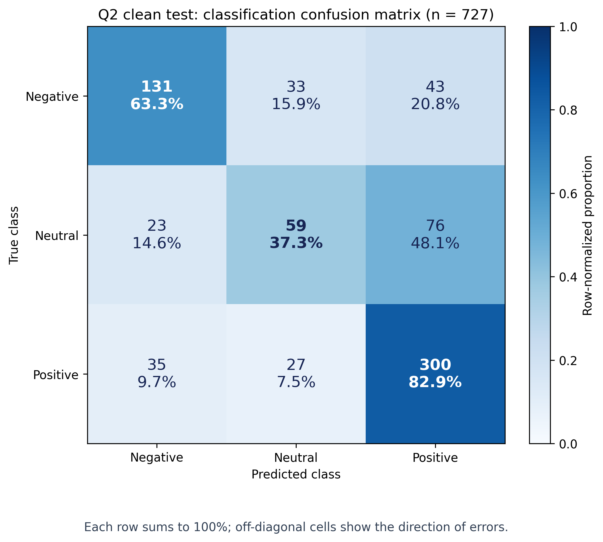
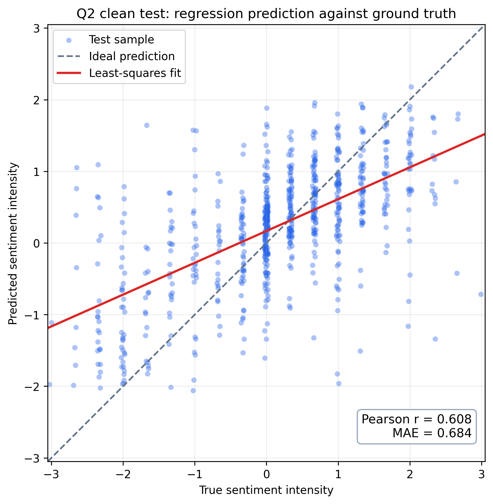

# Q2 最终实验与交付报告

## 结论先行

本轮最终采用单个 `late_attn_tune` 模型：官方 `google/bert_uncased_L-8_H-256_A-4`，seed=1111，八个 Transformer 层全部微调、embedding 冻结、CLS 上下文启用、无类别偏置。valid 选择第 10 轮，使用实际导出包重新评估后，test clean 三分类 Macro-F1 为 **0.618618**，72 个局部缺失场景等权平均 Macro-F1 为 **0.575404**。因此已经超过“完整输入 test F1 至少 0.60”的当前指标，但缺失场景平均仍未达到 0.60。

这里必须披露一个流程边界：题目要求在 valid 上选择模型结构、超参数和阈值。本项目早期已经查看 test，并据 test 探索结果决定继续验证八层 BERT；用户明确选择以该较高 test 模型作为主结果。因此本报告把它作为**已观察 test 后的自适应探索结果**，不能声称是严格 valid-only、未见 test 的正式泛化确认。模型没有使用 test 标签训练、校准或改标签；第 10 轮仍由 valid 缺失网格选择。

## 最终模型和数据

- 仅使用附件2 `aligned_50.pkl`：train/valid/test 为 3395/728/727；没有引入额外数据集。
- train 统计量用于音频、视觉逐维标准化和类别权重；附件3、附件4不参与训练或调参。
- 分类类别顺序为 Negative/Neutral/Positive；连续分数范围为 [-3,3]。
- 训练输入为 50 个官方 aligned 位置。文本在 token 输入端按当前掩码替换并重新编码；音频、视觉的零行保持不可用，不均值填补、不删除样本。
- 三路分别 Linear→LayerNorm→GELU→Dropout(0.3)，仅对观测位置做注意力池化；拼接三路128维向量和可用标志后，经 387→128 晚融合层，独立输出三分类 logits 和回归分数。
- 损失为加权 CE + Huber(delta=1)，回归系数1；train 类别先验负半次方权重；前两轮 clean-only，之后 clean 与局部受损视图共同监督。训练 20 轮，AdamW，下游峰值1e-4，BERT峰值1e-5，batch=32，梯度裁剪1，FP32计算、AMP/TF32/compile关闭。
- 训练期受损视图使用局部连续区间；预热后50%从公开72场景网格抽取，50%使用原课程。正 rho 的区间宽度为 `floor(rho×包络长度+0.5)`，至少1个位置。

## 最终指标

| split | 条件 | Accuracy | Macro-F1 | Weighted-F1 | MAE | Pearson |
|---|---|---:|---:|---:|---:|---:|
| valid | clean | 0.6154 | 0.577807 | 0.6057 | 0.6415 | 0.6082 |
| valid | 72场景均值 | 0.5796 | 0.546551 | 0.5742 | 0.6666 | 0.5493 |
| test | clean | 0.6740 | **0.618618** | 0.6635 | 0.6841 | 0.6081 |
| test | 72场景均值 | 0.6267 | **0.575404** | 0.6209 | 0.7215 | 0.5498 |

test clean 三类 F1 为 Negative **0.6616**、Neutral **0.4260**、Positive **0.7682**；72场景均值的三类 F1 为 **0.5969/0.3971/0.7322**。中性类是主要瓶颈，不能用 weighted-F1 代替 Macro-F1。

test clean 中，真实中性样本共158条，只有59条（37.3%）预测为中性；23条（14.6%）预测为负向、76条（48.1%）预测为正向。中性误差明显被推向两侧且更常偏向正向，详见[诊断图说明](诊断图说明.md)。

回归散点图按实际导出包重推理绘制，Pearson=0.608102、MAE=0.684072；预测强度相对理想线向中心收缩，极端值更容易被低估。

test 缺失规律清晰：单文本缺失 Macro-F1=0.5403，单音频=0.6099，单视觉=0.6154；rho=0.2/0.4/0.6/0.8 时分别为 0.6017/0.5902/0.5696/0.5401；front/middle/rear 为 0.5805/0.5792/0.5665。文本缺失及较长区间缺失退化最大。完整的 72 场景表、配对共同样本、实际删除率分层、8 个压力场景和图表见 [最终结果表格](最终结果表格.md)。

全空 test 输入回退训练先验，Macro-F1=0.221610、Accuracy=0.497937、MAE=0.884915，预测为常数正类；该结果是信息不可用时的先验基线，不能冒充缺失建模性能。

## 探索结果和结论

所有候选均在已有 test 观察历史下标为探索；未因 valid 变化小而跳过 test。主结果不能与这些结果混合成独立 holdout 证据。

| 探索 | test缺失 Macro-F1 | test clean Macro-F1 | 结论 |
|---|---:|---:|---|
| 原课程、reg=0.25，三种子均值 | 0.559022 | 0.593276 | 参考基线 |
| 网格混合、reg=1，三种子均值 | 0.566691 | 0.598734 | 缺失有小幅提升，仍低于0.60 |
| 辅助单模态分类，0.2，三种子均值 | 0.566147 | 0.601042 | clean略升，缺失略降，不采用 |
| z裁剪3/5，seed1111 | 0.569322/0.569163 | 0.597715/0.596818 | 效应很小，不说明数据错误 |
| 特征教师一致性0.2/1.0 | 0.566903/0.566433 | 0.592656/0.593658 | 均下降，不采用 |
| BERT8、仅顶部4层微调 | 0.568733 | 0.599249 | 不足以说明所有深层模型无效 |
| BERT8、全部8层微调，seed1111 | **0.575404** | **0.618618** | 最终候选 |
| BERT8全部8层，seed1112/1113 | 0.561138/0.567513 | 0.592796/0.597259 | 固定配置复验波动较大 |
| 最终模型去掉CLS上下文 | 0.566413 | 0.603143 | CLS对clean有帮助 |
| 最终模型不做人工受损训练 | 0.550355 | 0.580117 | 局部缺失训练有效 |
| 最终结构改均值池化 | 0.567688 | 0.606158 | 注意力池化更好 |
| BERT4三模型 raw-logit 集成 | 0.573598 | 0.608641 | 探索结果，存储代价高，未采用 |

还评估了 embedding 解冻、提高文本学习率、文本 stress、GRU、门控、A/V 分支、视频重复计权、回归系数、类别权重、30/40轮和多个历史 full/pool 结构；没有发现比最终单 BERT8 同时更好的可靠结果。完整 73 个保存 trial、58 条评估记录、超参数、资源与失败原因在 `results/experiment_ledger.json`，历史方法过程见 `E题_Q2_优化方案_v3_实验中.md`、`E题_Q2_优化实现说明_v2_实验中.md`。

## 数据、对齐和题目合规审计

- 三划分样本 ID 和来源 video_id 无交集；未发现 NaN/Inf；标签符号与类别映射一致。
- 同一 WordPiece tokenizer 可重建三划分 input_ids、attention_mask、token_type_ids；子词复制的音频/视觉行和 CLS/SEP/首个 padding 位置检查一致。
- PKL 没有原始时间戳、帧映射和生成版本，因而只能证明存储索引一致，不能证明物理逐词时间对齐完全正确。
- 自然全零音频/视觉行的原因无法从附件判断，不能写成提取失败或人工缺失；没有把它们均值填补为观测。
- 附件3审计显示30条样本没有文本 MASK，29条音频/视觉可用位置完全相同；缺口分散且最长连续缺口不超过4个位置。因此专项输入不应被简化成“必为一个连续块”。

## 附件3、资源与离线验证

最终包中的 `results/final/q2_predictions_aligned.csv` 有30条专项预测；专项无标签，不计算准确率。最终包 [q2_final.zip](../../Q2/delivery/q2_final.zip) 为 27,138,297 bytes，解压目录 30,253,681 bytes，低于 Q2 单目录 50MB；题目要求的是全题 Q1+Q2+Q3 合计不超过50MB，尚未核验全题合包大小，不能宣称整题已经满足该限制。

离线新进程加载最终包通过：30条专项输出逐字段一致；valid/test clean、partial、empty 前向均能加载。FP32 checkpoint 与最终 FP16 存储包的最大差异为 logits 0.002242、score 0.002018，预测类别一致。GPU评估 valid/test各约25秒，warm batch32中位延迟0.01291秒，约2479 samples/s（含CPU到GPU复制）。

附件3专项状态和预测位于 `results/final/`；Q3当前应使用实际晚融合模型输出的观测状态和位置表示。模型没有补偿分支，不能虚构补偿贡献；池化权重尚未作为前向返回字段，若Q3需要该解释量，需先扩展接口并重新验证。

## 本地归档和服务器清理

服务器结果归档 `q2_results_final.tar.gz` 已同步到本地 `.audit/`，SHA-256 为 `3361f1cd6c2b7e22ad8394cb8e1f90598b59d5a9ddacc444dfe1f5b33c9d15ee`。本地 Q2 已保存最终包、valid/test 原始指标、72场景 CSV、专项30行预测、experiment ledger、审计结果和最终表格。

为给第3问腾出空间，服务器已删除已同步且不再用于推理的历史 `experiments/*`，删除可重建 `.cache`；保留代码、`data/processed`、`data/masks`、BERT8模型、最终候选和最后几项消融目录。数据盘从约98%使用、剩余1.3GB恢复到约63%使用、剩余约19GB。最后一次清理前所有结果已归档；服务器未删除最终模型或Q3所需输入。

## 复现入口

- 最终配置：`configs/final_selection.json`、`configs/final_train.yaml`。
- 方法说明：[Q2最终方法与实现](Q2_最终方法与实现.md)。
- 全量结果表：[最终结果表格](最终结果表格.md)。
- 代码入口：`src/q2/`、`scripts/evaluate_experiment.py`、`scripts/finalize_q2.py`。
- 本地测试：当前修改相关测试已通过；服务器最终包离线重载验证通过。所有数据集、训练权重和大缓存不提交 GitHub，代码、配置和结果证据位于 `Q2`，方案与报告位于仓库 `doc/Q2`。
