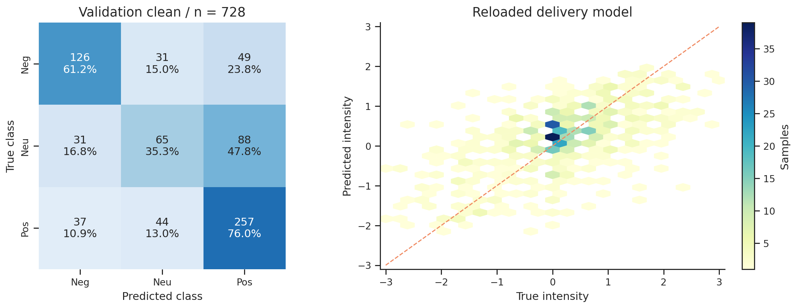
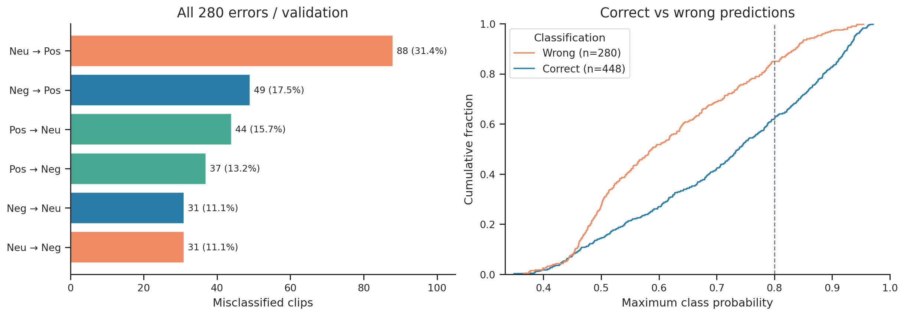
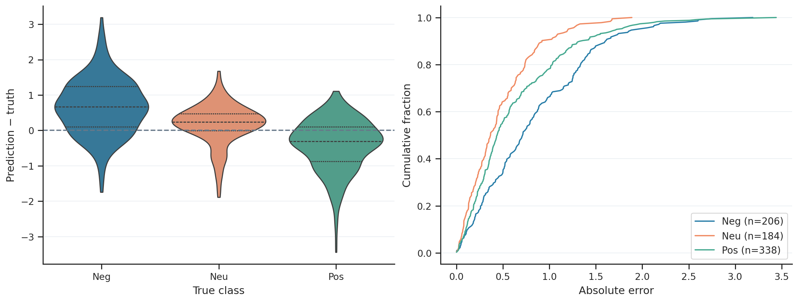
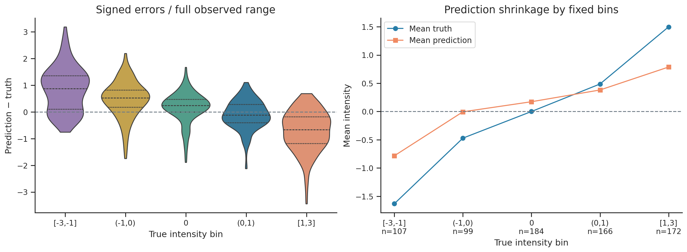
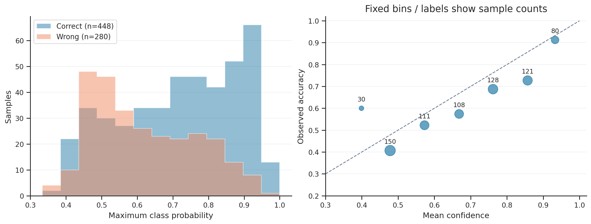
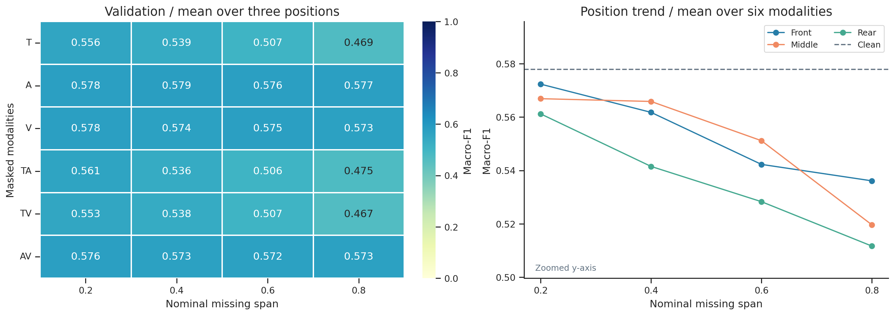
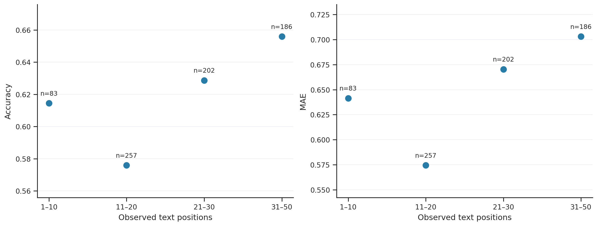

# 问题二（4）：验证集上的基础性能评价、可视化分析与错误归因结论

本文单独对应题目“问题2相关内容”的第（4）项。此前相关材料散见于Q2总报告第4节与Q2_16–Q2_19；本文集中提供评价协议、指标表、图、逐类/逐样本错误证据及可用于论文的结论。新增分析只读取已保存结果，没有重训、重新选模或修改预测。

## 1. 评价对象与数据口径

评价模型为最终交付的单模型 `late_attn_tune`，seed=1111、epoch=10：八层BERT微调、逐模态掩码注意力池化、晚融合、分类与连续强度双输出。分类由三分类概率argmax确定，回归直接使用独立连续输出；不用回归分数改写分类结果。

附件2的train/valid/test分别为3395/728/727条。本节只报告**valid的728条、239个源视频**；类别为Negative 206、Neutral 184、Positive 338，标签顺序固定为0/1/2。附件3没有真值，不参与本节评价。

- **clean**：不额外施加人工缺失，仍保留数据本身的不可观测行；其中15条没有可观测视觉，不能把clean称为每条都完整三模态。
- **局部缺失**：T/A/V/TA/TV/AV六种删除组合 × front/middle/rear三个位置 × 0.2/0.4/0.6/0.8四种名义跨度，共72场景。每场景评价同样728条，先计算场景指标，再等权平均。T/A/V分别指文本/声学/视觉；TA表示同时删除文本与声学。
- **压力测试**：整模态与错位缺失另行报告，不混入72场景均值。

valid曾用于checkpoint及开发决策，故结果属于开发集评价，不是独立留出泛化确认。同一视频含多个clip，72场景重复使用同一批样本；本节不把它们当成52416个独立样本，不据这些描述性差异宣称统计显著。另，历史test曾影响架构探索，这一限制仍须在整篇论文中披露。

评价指标采用Accuracy、Macro-F1、Weighted-F1、MAE、Pearson。Macro-F1对三个类别F1等权平均，用于避免正类数量较多遮蔽中性类问题；MAE度量强度偏差，Pearson度量线性相关，相关性高不代表幅度预测准确。新增RMSE只作补充，不替代原选择指标。

## 2. 基础性能评价

### 2.1 总体指标

| 输入条件 | 样本/场景口径 | Accuracy ↑ | Macro-F1 ↑ | Weighted-F1 ↑ | MAE ↓ | Pearson ↑ |
|---|---|---:|---:|---:|---:|---:|
| clean | 728条，单次完整评价 | 0.615385 | 0.577807 | 0.605695 | 0.641531 | 0.608243 |
| 72局部缺失场景均值 | 每场景728条，场景等权 | 0.579556 | 0.546551 | 0.574165 | 0.666564 | 0.549331 |
| 缺失均值−clean | 配置级指标差 | −0.035829 | −0.031256 | −0.031530 | +0.025033 | −0.058912 |

clean判对448条、判错280条；从逐样本CSV补算RMSE=0.845606。模型在局部缺失下仍保留一定性能，但Macro-F1下降3.13个百分点。仅凭此表不能将保持能力全部归功于某个训练模块；模块贡献需结合原消融实验。

数据来自[原始valid指标](../../Q2/results/final/valid/metrics.json)、[逐场景表](../../Q2/results/final/valid/metrics_per_scenario.csv)。clean的[交付包重载预测](../paper_figures/data/Q2_valid_reloaded_predictions.csv)与既有分类指标一致，浮点回归指标差在约10^-8量级；本次CSV复算又有文本小数保存误差，均不改变六位小数的主结论。

### 2.2 逐类别指标

| 真实类别 | support | Precision | Recall | F1 | 错误数 | 72场景平均F1 |
|---|---:|---:|---:|---:|---:|---:|
| Negative | 206 | 0.649485 | 0.611650 | 0.630000 | 80 | 0.565185 |
| Neutral | 184 | 0.464286 | 0.353261 | 0.401235 | 119 | 0.400042 |
| Positive | 338 | 0.652284 | 0.760355 | 0.702186 | 81 | 0.674426 |

Neutral只有65/184条判对，是主要分类瓶颈，贡献119/280=42.5%的全部错误。Positive的召回率最高。局部缺失下，Negative F1下降0.064815、Positive下降0.027759，Neutral从较低起点仅下降0.001193；“中性类下降小”不能解释为它已经鲁棒或识别充分。

## 3. 可视化分析与定量解释

### 图1：混淆矩阵与真实—预测强度密度（已有Q2_16）

混淆矩阵行是真实类、列是预测类：

| 真实\预测 | Negative | Neutral | Positive | 合计 |
|---|---:|---:|---:|---:|
| Negative | 126 | 31 | 49 | 206 |
| Neutral | 31 | 65 | 88 | 184 |
| Positive | 37 | 44 | 257 | 338 |

模型预测正类394条，多于真实正类338条；预测中性140条，少于真实中性184条。这是当前预测分布偏正、偏离中性类的直接证据，不足以单独证明训练类别不均衡是原因。密度图中的对角线表示无误差；较强正负情感的预测幅度偏小，需要结合下文有符号残差量化。

### 图2：全部误分类流向与置信度（新增Q2_20）

280条错误完整分解为：Neutral→Positive 88、Negative→Positive 49、Positive→Neutral 44、Positive→Negative 37、Negative→Neutral 31、Neutral→Negative 31。最大的单一流向是Neutral→Positive，占全部错误31.43%，占真实中性47.83%；并非所有错误都发生在相邻类别，正负互换共有86条，占全部错误30.71%。

正确与错误预测的置信度分布重叠。以0.8作为**事后描述参考线**，212条高置信度预测中仍有42条错误，错误率19.81%。本次没有用该值设置拒识策略或调整预测。置信度是模型概率，不能作为结果正确的保证。完整流向表见[CSV](../paper_figures/data/Q2_valid_error_flows.csv)，[全部280条错误清单](../paper_figures/data/Q2_valid_all_errors.csv)保留ID、真值、预测、三类概率、观测数量和置信度排名。

### 图3：分真实类别的回归误差（已有Q2_17）

定义残差 (e=\hat{s}-s)。正值是数值高估，负值是数值低估；负情感被“高估”通常表示变得较不负。

| 真实类别 | 真值均值 | 预测均值 | 平均残差 | MAE |
|---|---:|---:|---:|---:|
| Negative | −1.074434 | −0.409791 | +0.664643 | 0.829373 |
| Neutral | 0.000000 | +0.173000 | +0.173000 | 0.462909 |
| Positive | +1.001479 | +0.587653 | −0.413826 | 0.624286 |

负类MAE最大，正负类别的均值均朝零缩小，且中性组存在正向均值偏移。这比比较“真实中性”和“预测中性”两个不同人群的绝对分数更能支持幅度收缩的描述。类别汇总见[CSV](../paper_figures/data/Q2_valid_class_error_summary.csv)。

### 图4：强度分层偏差（新增Q2_21）

固定强度区间如下，零值单独成组，未按结果调节分箱或剔除离群点：

| 真值范围 | n | 分类Accuracy | 回归MAE | 平均残差 | 真值均值→预测均值 |
|---|---:|---:|---:|---:|---|
| [−3,−1] | 107 | 0.822430 | 0.955834 | +0.848392 | −1.632399→−0.784007 |
| (−1,0) | 99 | 0.383838 | 0.692694 | +0.466045 | −0.471380→−0.005336 |
| {0} | 184 | 0.353261 | 0.462909 | +0.173000 | 0→+0.173000 |
| (0,1) | 166 | 0.662651 | 0.426631 | −0.105916 | +0.486948→+0.381032 |
| [1,3] | 172 | 0.854651 | 0.815046 | −0.710995 | +1.498062→+0.787067 |

**分类边界困难与强度幅度困难是两个问题**：弱负类和中性类分类正确率低；较强正负组虽较容易判对类别，却有较大的幅度误差。Huber损失、标签分布或上下文压缩可能参与形成收缩，但没有同条件受控对照时，只能作为后续验证假设。分箱明细见[CSV](../paper_figures/data/Q2_valid_intensity_bins.csv)。

### 图5：置信度诊断（已有Q2_18）

右图用固定7个等宽区间，圆面积和数字表示样本数，对角线表示均值置信度等于经验正确率。全体均值置信度为0.680347，而Accuracy为0.615385，存在总体过度自信倾向；这不是每一分箱都过度自信的断言。少量样本的分箱应谨慎解读。本轮没有进行温度校准拟合，可靠性图是事后诊断。[分箱数值](../paper_figures/data/Q2_valid_confidence_bins.csv)可直接复算。

### 图6：验证集局部缺失规律（新增Q2_22）

| 删除模态 | 场景数 | 平均Macro-F1 | 平均MAE |
|---|---:|---:|---:|
| T | 12 | 0.517870 | 0.688811 |
| A | 12 | 0.577228 | 0.642459 |
| V | 12 | 0.574777 | 0.642792 |
| TA | 12 | 0.519591 | 0.691092 |
| TV | 12 | 0.516349 | 0.689261 |
| AV | 12 | 0.573492 | 0.644969 |

涉及文本删除的三组更差；仅删除A/V时仍保留文本，退化较小。这支持“当前模型在此缺失协议下更依赖文本”的结论，不能解释为A/V信息没有价值。特别注意：AV表示删除A和V、保留T；不能写成“保留A+V更稳”。

名义跨度0.2/0.4/0.6/0.8的平均Macro-F1为0.566794/0.556368/0.540568/0.522474；front/middle/rear平均为0.553114/0.550878/0.535662，rear总体更弱，但不是每种跨度下都有同一排序。整路删除T的压力结果为Macro-F1=0.3393、MAE=0.8602，是另一个文本依赖证据；不纳入上述72场景均值。

这些是预定义输入扰动下的模型敏感性，不直接证明某段文本在人类情绪上具有因果作用。名义跨度与实际删掉的观测比例不同；更细的同样本/实际删除率配对见[原结果目录](../../Q2/results/final/valid/)。本图全部72行数值见[CSV](../paper_figures/data/Q2_22_valid_missing_profile.csv)。

### 图7：文本长度分层（已有Q2_19）

有效文本位置1–10/11–20/21–30/31–50对应n=83/257/202/186，Accuracy=0.6145/0.5759/0.6287/0.6559，MAE=0.6414/0.5744/0.6703/0.7031。分类与回归没有统一的长度改善趋势，不足以认定“短句导致错误”。同样，15条视觉不可观测样本Accuracy=0.6667、MAE=0.4618，713条视觉可观测样本为0.6143、0.6453；两组构成不同且前者很小，不能由此声称视觉缺失提升性能，也不能把280条错误都归因于视觉缺失。

## 4. 可核查错误案例与归因层级

案例由明确规则选取：前3行是错误分类中置信度最高的3条；后2行是全体回归绝对误差最大的2条，完整错误仍保留于CSV，不能将这些极端案例当作总体代表。Neg/Neu/Pos分别表示负/中性/正。

| 样本ID | 选择规则 | 真类→预测类 | 真值→预测强度 | 最大类别概率 | 可确认的问题 |
|---|---|---|---|---:|---|
| `32681$_$5` | 分类错误置信度第1 | Pos→Neg | +0.333333→−1.731497 | 0.954114 | 弱正类发生高置信度极性反转 |
| `236021$_$3` | 分类错误置信度第2 | Neu→Neg | 0→−1.656937 | 0.942664 | 中性被判为明显负向，双任务均偏离真值 |
| `130456$_$11` | 分类错误置信度第3 | Pos→Neg | +1.666667→−1.421234 | 0.941322 | 正负极性反转，绝对强度误差3.087900 |
| `130456$_$3` | 回归绝对误差第1 | Pos→Neg | +2.333333→−1.108021 | 见逐样本CSV | 绝对误差3.441354，正负互换 |
| `266791$_$23` | 回归绝对误差第2 | Neg→Pos | −2.666667→+0.522987 | 见逐样本CSV | 绝对误差3.189653，正负互换 |

本节没有新增原视频听审、转录语境标注或逐样本受控反事实，因此不能声称这些ID已经证实存在讽刺、否定词误解、音画冲突或标签错误。归因应按下面的证据层级表述：

| 错误现象 | 直接证据与可支持结论 | 尚未验证的机制解释 |
|---|---|---|
| 中性/弱负类难分 | 中性Recall=0.3533；弱负类Accuracy=0.3838；中性→正类88条 | 类别先验、语境歧义、局部特征不足可能相关，但未作各因素独立对照 |
| 强度幅度收缩 | 强负/强正组均值分别向零移动0.8484/0.7110 | 损失函数、训练强度分布或共享表示对幅度的影响待消融 |
| 高置信度错误 | 212条confidence≥0.8预测中42条错误 | 可提示校准不足，不能仅凭概率确定语义原因 |
| 文本扰动更敏感 | 删T/TA/TV的均值低于删A/V/AV；T整路删除F1=0.3393 | 说明固定模型对文本依赖较强，不证明声画天然无用 |
| 自然缺失与长度 | 分层并无统一单调规律，小样本组构成不一致 | 当前证据不支持把它们列为所有错误的主要原因 |

额外口径提醒：既有metrics中的 `symbol_inconsistency=309/728` 按**真实类别**与回归分数符号计算，其中真实Neutral要求分数严格等于0，故184条中性全部计入。该值不是“分类头与回归头相互矛盾率”，更不是309条分类错误。本节分类错误数始终为280。

## 5. 可直接用于论文的结论段

在包含728条样本的验证集上，最终模型在无额外人工缺失时取得Accuracy=0.6154、Macro-F1=0.5778、MAE=0.6415和Pearson=0.6082。逐类结果显示，中性类Recall仅为0.3533，184条中性样本中有88条被预测为正类，是最主要的误分类流向。按真实强度分层进一步发现，弱负类与中性类主要表现为类别边界识别困难，而较强正负情感虽较易判对类别，预测幅度仍明显向零收缩。置信度分析也显示，高概率输出不能保证正确，置信度不低于0.8的212条预测中仍有42条错误。在72个预定义局部缺失场景中，平均Macro-F1为0.5466，较clean下降3.13个百分点；涉及文本及长跨度缺失的退化更明显，表明当前模型在该输入扰动协议下更依赖文本信息。以上结论是验证集上的性能与错误结构描述，未将自动统计现象扩展为未经听审或受控消融证实的语义原因。

## 6. 文件、图表与复算

本文图1/3/5/7复用Q2_16/17/18/19；图2/4/6为新绘制Q2_20/21/22。每图在[Q2图目录](../paper_figures/figures/Q2/)提供PNG、PDF、SVG；论文插图优先使用PDF。表格及全部错误清单在[数据目录](../paper_figures/data/)，图注和来源登记在[统一图册说明](../paper_figures/README.md)。

本次补图及诊断统计可在仓库根目录运行 `python scripts/build_q2_validation_section.py` 复算，仅需numpy、pandas、matplotlib、seaborn和Pillow，不需要模型权重、原始视频或服务器。脚本核对728个唯一ID、argmax分类与既有混淆矩阵，输出[本节统计摘要](../paper_figures/data/Q2_valid_section_summary.json)。旧图重绘使用全量入口 `scripts/build_paper_figures.py`，其归档依赖见图册说明。本节没有修改模型、标签、预测或训练记录。
