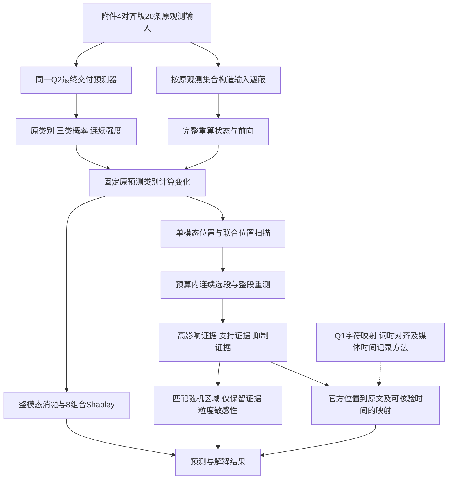

# E题 Q3：基于多粒度输入遮蔽的多模态情感预测解释方法

> **最终结项**：Q3迭代已于2026-09-26结束。题目要求与交付范围按[最终收尾口径](../../Q3/reports/iteration_v2/Q3_最终方法与质量结论.md)解释；下文历史计划不再产生新的待办。保留输入空间归因与原文定位结论，不夸大声画时间映射证据。

> **当前执行状态与方法修订｜2026-09-26**：728条valid和20条专项的迭代2已完成；本文件下文“尚未启动”“服务器没有Q3”“先编写入口”等措辞属于2026-09-25初版历史，不再表示当前状态。当前实际方法、核验结果与诚实限制，以[最终方法与质量结论](../../Q3/reports/iteration_v2/Q3_最终方法与质量结论.md)和[完整实验报告](../../Q3/reports/iteration_v2/Q3_实验报告.md)为准。
>
> 最终方法修订：完整单元严格随机匹配（片段长度多重集合、模态成本、目标排除），Floyd无放回抽样后独立随机排列，避免跨模态按位置排序引入联合保留相关性；预算取不超过目标的最大可达成本，整词不切断；整组真实联合遮蔽并设置同成本point比较。block3实际是固定不重叠官方索引块，只能作粒度敏感性，不能称为已核实的复制组或真实时间片。valid按239个video_id簇抽样，簇内按样本数加权，报告真实可比分母和失败候选。
>
> 服务器配置为 `Q3/configs/q3_v2_server.yaml`，GPU推理环境为 `Q2/.venv/bin/python`；具体复算命令见[Q3 README](../../Q3/README.md)。初版 `q3.yaml` 与本地CPU配置不能替代当前服务器配置。CTC入口仍依赖同级Q1源码和权重，尚不满足初版“无Q1项目也能独立运行”的便携性目标；本轮复用了既有词时，不把机械检查称为人工听审。官方A/V来源仍 unresolved。

> **v9 方法审核稿｜Q1/Q2闭环与实际代码核查版｜2026-09-25**
>
> 本稿承接文件名为“v4_参考方法吸收审核版”、正文版本为v8的原稿，另存新文件供对照。只确定方法、数学定义、评价设计和复用边界；不制定具体开发任务、脚本命令或服务器实施排期，不启动Q3实验。用户审核通过后，再撰写具体实现方案。
>
> **迭代 2 方法修订（2026-09-26）**：根据代码审查和服务器 pilot，本方法的随机对照被具体化为“完整连续单元空间”中的严格匹配抽样：每个对照同时保持选段长度多重集合、三模态删除成本和目标排除，目标空间不足时报告最大可达成本，不用几何不匹配的集合填充。support/suppress 方向候选先按原预测类别的有符号变化排序，整段重测后保存 `direction_retained`，方向失败仍保留在结果中。valid 的置信区间改为按 `video_id` 整簇重采样，并在簇内按样本数加权；这避免同一视频的重复片段被当作独立视频证据。主要模态同时报告分类头和强度头首位，分歧单独记录。文本/tokenizer、CTC 词时和官方 A/V 来源分别保留 `verified`、`pending`、`unresolved` 等状态；算法接受不等于人工核验或官方素材来源已证实。
>
> 已有事实、代码推论与待验证假设分别注明。本文中的Q2数值来自已有报告，本轮未重新训练或复测模型；Q3尚无实验成绩。Q1当前未完成的多模态对齐工作保持原进度，不在本轮补做。

## 1. 建议采用的方法及本次审核结论

**以Q2最终交付的单个八层BERT晚融合模型为解释对象，在专项样本原观测输入上输出预测，然后进行模态删除、模态组合分析、局部遮蔽和连续片段联合重测；用匹配随机区域与仅保留证据实验检验模型忠实性，再把能核验的特征位置回溯到原文和音视频。**

解释对象始终是同一个部署预测器的原样预测。Q3不训练新的解释用分类器，也不通过修改输入特征定义、插入补偿器或重训Q2来制造更好看的解释。这里的“反事实”专指给定模型和遮蔽规则下的输入干预，不是现实情感因果识别，也不是寻找使类别翻转的最小自然语言改写。

本方法的研究价值在于：把**实际观测状态、预测目标、干预粒度、连续证据、模型忠实性和素材定位依据**放在同一条可检验链条内。不能把遮蔽、Shapley或普通时间分段各自包装成新算法。

### 1.1 相对原稿的实质修订

| 审核发现 | 本稿处理 | 为什么影响方法成立 |
|---|---|---|
| 旧稿依据Q2早期MSD—补偿—可靠性方案 | 改为最终`late_attn_tune`、八层BERT、seed1111；取消补偿贡献与来源重建实验 | 最终模型没有这些分支，解释不能依赖不存在的机制 |
| “完整三模态”容易理解为每个位置均有内容 | 改称“原观测输入，无新增人工遮蔽”；保留自然零行、特殊词元及原有缺失 | 附件4对齐版13号视觉全零，不能制造视觉证据 |
| 只核对文档中约定的推理接口 | 同时核对最终配置、实际源码和本地交付包的加载格式 | 当前最终包由`load_ensemble`加载，但只有一个成员；旧`load_bundle`不是该包的直接入口 |
| 单位置可能切断一个词或漏掉复制到多个子词的音视频内容 | 保留单位置主扫描，必须增加整词/有依据的复制组遮蔽敏感性分析 | 单点影响小可能来自重复内容仍保留，不能推出整词或声画不重要 |
| 注意力与时间位置容易被过度解释 | 明确池化权重尚未返回；音视频最终分支不编码行顺序 | 连续性来自解释器的呈现约束，不能称模型学到了情绪时序因果 |
| 绝对影响与支持证据混用 | 分开“高影响主证据”和“支持/抑制方向证据”；整段重新测符号 | 强影响可能使原类别概率下降，也可能上升 |
| 相对模态权重可能掩盖整体影响很小 | 同时输出原始变化与归一化权重；零影响不均摊 | 不能把极小的0.001与0.0005写成有把握的“主要依赖67%” |
| 随机对照匹配及统计独立性不够明确 | 匹配实际删除量、模态及片段几何；在样本/来源视频层统计 | 避免把不同删除量、重复随机掩码当独立证据 |
| 对test身份的表述已过时 | 继承Q2自适应探索的披露，Q3以valid开发评价、附件4案例为主 | 不能通过新增解释方法把已观察test恢复成独立留出集 |
| Q1到官方音视频行的时间桥接仍无保证 | 拆分“原文定位”“词时定位”“官方音视频行定位”三种证据等级 | 一个词的时间正确，不证明官方同编号声画特征来自该词 |

### 1.2 审核时优先查看

第2节给出题目与项目事实；第3—7节确定归因和选段；第8节规定怎样验证；第9节说明素材回溯能做到什么；第10节给出三问闭环；第12节列出真实代码复用情况。实现阶段的函数组织、文件字段和运行批次不在本稿展开。



## 2. 题目、数据与已完成工作的约束

### 2.1 题目对应关系

依据本地题目正文及[数据总结](../E题数据细节.md)，Q3需要在附件4所选版本的20条样本上，给出三分类极性、连续情感强度、主要参考模态、三模态作用程度和可回到素材的关键证据；最终交付预测与解释CSV。附件4无情感真值和解释真值，不计算专项准确率、Macro-F1或“解释准确率”。

采用与Q2相同的官方`aligned_50`输入路线。附件2官方train/valid/test分别为3395/728/727条；同编号的对齐与未对齐版本不是独立样本，不能合并增加样本量。附件4内容仅用于专项推理和定位，不用于选择模型、归因超参数或好看的案例阈值。

所谓原样输入，是没有新增人工删除的当前观测。它不保证三模态均非空，也不保证50行均有效。附件4对齐版13号视觉全零这一已总结事实必须进入方法设计：视觉删除影响为0，局部视觉证据为不适用；即使原视频看得到人脸，也不能把视频中的脸当成该模型实际接收的视觉信息。

### 2.2 Q2最终预测器：本稿采用的事实基准

以[最终报告](../Q2/report.md)、[最终方法](../Q2/Q2_最终方法与实现.md)、[最终选择配置](../../Q2/configs/final_selection.json)及本地最终交付包共同确认：

| 项目 | 当前事实及Q3含义 |
|---|---|
| 模型 | `late_attn_tune`，单模型seed1111，valid选第10轮 |
| 文本 | `google/bert_uncased_L-8_H-256_A-4`；训练时8个Transformer层微调、embedding冻结；解释时全部参数固定 |
| 文本输入 | 官方`text_bert`的ID、attention与token_type，经实际微调BERT重新编码；每个观测token叠加当前CLS上下文 |
| 音视频 | 官方74维音频、35维视觉，使用train统计量标准化；不换成Q1的25/22维自提取特征 |
| 融合 | 三路独立逐行映射到128维、观测掩码注意力池化；拼接三路向量与3个存在标志，经387→128层融合 |
| 输出 | Negative/Neutral/Positive三分类；独立回归头输出`3*tanh(·)` |
| 不存在的机制 | 最终部署无MSD、教师、重建补偿、可靠性门控、类别偏置或多模型集成 |
| 全空输入 | 分类回退train类别先验，强度回退train中位数；不能称恢复信息 |
| 实际部署精度 | 文本权重FP16存储、FP32计算；Q3使用实际导出包作为数值参照 |

Q2报告记载checkpoint与导出包存在微小数值差异，因此不能把checkpoint的原预测与导出包的遮蔽预测混在一个差值中。所有原样、干预、空集和随机对照均用同一加载对象。

| 已有Q2结果 | valid | test（已观察后的探索结果） |
|---|---:|---:|
| 原观测Macro-F1 | 0.577807 | 0.618618 |
| 72局部缺失条件平均Macro-F1 | 0.546551 | 0.575404 |
| 原观测MAE | 0.6415 | 0.6841 |

test原观测中性类F1为0.4260；单文本、音频、视觉缺失条件的平均Macro-F1分别约0.5403、0.6099、0.6154。它们提示应关注文本依赖和中性类失败，但不是预先强制Q3“文本最重要”的理由。数据集性能退化与单样本输出敏感性是不同统计量，必须分别报告。

**评价身份限制：** Q2已明确披露观察test影响了架构探索，偏离题目要求的valid-only选模流程；第10轮仍按valid选择。Q3继承这个限制，不重写历史。valid也已参与模型选择，Q3在其上的结果是开发集方法评价，不能称完全独立的泛化确认。

### 2.3 Q1能复用什么、不能替代什么

Q1按真实片段时间提取768维文本、25维声学、22维视觉并聚合到50个相对时间窗；Q2/Q3的50是官方位置。两者长度相同不代表坐标或特征含义相同。

Q3复用Q1的**原文字符对应、WordPiece记录、CTC词时对齐、媒体时间偏移与PTS记录的技术方法**，不直接复制Q1的50窗边界，不把Q1的100条全量加入训练，也不把Q1特征送入现有Q2权重。Q1尚未完成的对齐验证不被本稿宣称完成；Q3的素材映射作为独立待核验环节保留。

## 3. 解释对象、观测集合与干预算子

### 3.1 统一符号

对单个样本，原观测输入记为 $X^0$，固定部署预测器为 $F$：

$$
F(X^0)=(p^0,s^0),\qquad c^*=\arg\max_c p_c^0.
$$

$p^0$为三类softmax概率，$s^0\in[-3,3]$。所有分类差值始终跟踪**原预测类别** $c^*$；遮蔽后即使类别改变，也不改差值的目标。预测概率只是模型分数，本稿未新增校准，不能叫正确概率。

官方位置 $t\in\{0,\ldots,49\}$，模态 $m\in\{T,A,V\}$。按Q2当前输入规则得到 $U^0_{tm}$，定义

$$
\mathcal O=\{(t,m):U^0_{tm}=1\},\qquad
\mathcal O_m=\{(t,m)\in\mathcal O\}.
$$

文本只有stored attention为1，且ID不是PAD/CLS/SEP/MASK的位置计为观测；UNK计为观测。音频或视觉一行任意维度非零即为观测。该定义是Q2实际操作规则，不把“零行”等同于已知的自然缺失原因。

结构位置 $J$ 和当前状态来自Q2原函数。确定待删集合和分母时用 $\mathcal O$；干预后计算模型内部状态时用当前输入重新推断的 $U^E,J^E$。不把干预后的分母反过来用于定义原始删除预算。

### 3.2 输入遮蔽与保留

给定 $E\subseteq\mathcal O$，令 $X^{-E}=M_E(X^0)$：

- 文本：选中ID改为MASK=103，保持原stored attention、token_type和序列位置。Q2的`infer_state`使MASK不参与BERT attention及观测池化；重新编码整条受损文本及其CLS。
- 音频、视觉：选中原始特征行置零，再走同一标准化和当前状态计算。不能把“标准化后置零”当成等价干预，因为原始零行承担缺失语义。
- 其余原始内容及自然零行保持原状。每个候选独立从 $X^0$ 构造，不累积上一候选的修改。

仅保留 $E$ 则为 $X^{keep(E)}=M_{\mathcal O\setminus E}(X^0)$。保留也执行同一缺失语义。

必须重跑完整预测路径。不能删除某个hidden向量后继续使用完整文本CLS，不能用完整文本缓存解释被删词的输入。对完全相同的文本前端输入可以复用确定性编码，但这是计算优化，不改变上述函数定义。

### 3.3 本方法识别的是哪种效应

$F(X^0)-F(X^{-E})$包含删除内容、重新上下文化、注意力池化重分配和模态存在标志变化的共同效应。它是**固定遮蔽规则下、给定其余输入的模型输出变化**，不能进一步声称已分离“内容本身的纯效应”。

整模态删除、全空和仅保留很少位置可能超出Q2主要训练分布。Q2缺失训练为该算子提供一定合理性，但不能保证所有极端输入都在分布内。报告时区分局部删除与整模态/少模态强干预；全空先验单列。

音视频最终分支在推理状态下逐行变换再池化，未加入行位置编码或时序网络。由代码结构可推得：在同一模态内同时置换特征行和观测掩码，保持其他输入不变，池化结果应不变（允许浮点误差）。因此音视频曲线说明“来源位置内容被删除后的影响”，不能证明模型利用了声画先后顺序。联合位置删除也不证明模型内部执行了逐词跨模态对齐。

## 4. 同时解释类别、强度与作用方向

### 4.1 每次干预保存的量

记 $F(X^{-E})=(p^{-E},s^{-E})$，定义：

$$
\Delta_c(E)=p^0_{c^*}-p^{-E}_{c^*},\qquad
\Delta_s(E)=(s^0-s^{-E})/6.
$$

两项均在 $[-1,1]$ 内。强度除以6是按整个输出范围缩放，不是用标签或样本方差调权。主影响量为

$$
D(E)=\tfrac12|\Delta_c(E)|+\tfrac12|\Delta_s(E)|\in[0,1].
$$

采用等权是明确的设计选择，不声称两项具有相同统计分布或同等人类感知意义。因此所有结果同时保留 $\Delta_c$、未缩放的 $s^0-s^{-E}$、类别是否改变和 $D$，不能只交一个综合分数。无需再训练一个解释评分器。

| 差值 | 合理表述 |
|---|---|
| $\Delta_c>0$ | 原输入中的该部分支持当前预测类别；删除它降低该类概率 |
| $\Delta_c<0$ | 该部分抑制当前预测类别；删除它提高该类概率 |
| $\Delta_s>0$ | 该部分把回归输出推向更积极方向 |
| $\Delta_s<0$ | 该部分把回归输出推向更消极方向 |

支持“负向类”与把强度推向积极方向可能同时出现，因为分类回归为独立头。必须如实展示这种分歧；不能用强度符号纠正分类，也不能把中性预测强度强制改为0。

作为分布变化诊断，另记

$$
TV(E)=\tfrac12\sum_c|p_c^0-p_c^{-E}|.
$$

它可发现 $p_{c^*}$ 变化很小但其他两类发生明显重分配的情形。TV不替换主目标，也不用于事后选择对自己最有利的解释指标。接近浮点误差的有符号变化记为数值上未区分方向；容差从同一部署模型的数值重复检查确定，不用固定0.01一类阈值冒充显著性。

### 4.2 整模态影响与主要参考模态

分别删除 $\mathcal O_T,\mathcal O_A,\mathcal O_V$：

$$
D_m=D(\mathcal O_m),\qquad
w_m=\frac{D_m}{\sum_{k\in\{T,A,V\}}D_k}.
$$

$w_m$只在总影响超过数值容差时定义；全部为零时输出“未区分主要模态”，不强行均分。无观测模态的删除没有改变输入，其 $D_m=0$，但其局部证据记为不适用。三模态均无观测时只展示先验预测，整个内容归因不适用。

主要参考模态按 $D_m$ 最大者确定，数值并列时保留并列；同时给出分类影响排序和强度影响排序。若两个头的首位模态不同，主表应注明“分类/强度依赖不一致”。$w_m$是该定义下的相对删除敏感性，不是模型注意力、情感占比、可靠性或因果责任百分比。总影响很小仍可能产生尖锐权重，故 $\sum_mD_m$ 和各 $D_m$ 必须与百分比一起展示。

整模态删除改变的内容数不同，因此这个排序回答“当前整路输入的净影响”，不回答“每一行的平均信息质量”。跨模态比较不得把删除量差异隐藏起来。

### 4.3 八子集精确Shapley作为常规辅助分析

三模态只有8种保留组合，成本很低，纳入常规辅助输出，用于识别“单路删除影响小，但在其他组合中仍有贡献”的情况；主表的 $w_m$ 仍按4.2节定义。

令 $N=\{T,A,V\}$，$X^S$仅保留 $S\subseteq N$ 中原观测内容，分别定义两个有符号目标：

$$
v_c(S)=p_{c^*}(X^S),\qquad v_s(S)=s(X^S)/6.
$$

对 $q\in\{c,s\}$，

$$
\phi_m^q=\sum_{S\subseteq N\setminus\{m\}}
\frac{|S|!(3-|S|-1)!}{3!}
\big[v_q(S\cup\{m\})-v_q(S)\big].
$$

同时报告 $v_q(\varnothing)$ 以及

$$
\sum_m\phi_m^q=v_q(N)-v_q(\varnothing).
$$

该恒等式可用于核对计算。无原观测的模态在此博弈中是空参与者，贡献应为0。8种名义组合中若有相同输入，只需计算一次，仍按上述完整公式求值。

**Shapley的解释边界：** 空集采用Q2全空先验；少模态组合沿用同一模型，因此所得贡献依赖这个参考与遮蔽语义。它分配的是相对空输入的模型输出差，不保证得到真实信息价值，更不能消除分布偏移。不能把 $|\phi|$ 归一化后替代有符号分解，也不能对非线性的 $D$ 强行声称满足同一加和恒等式。

已有原样和三个整模态删除视图覆盖4种组合，最多再加空集与三个单模态保留视图。若消融排序与Shapley排序不同，展示8组合预测解释差异，不把差异自动命名为协同，也不依据哪个更好看来更换主排序。

## 5. 局部定位及干预粒度

### 5.1 主扫描：单模态—官方位置

对每个 $(t,m)\in\mathcal O$，计算

$$
I_{tm}=D(\{(t,m)\}),
$$

并保存对应 $\Delta_c,\Delta_s,TV$。形成三行、50列的局部影响图；没有观测的格子显示不适用，已观测但输出未变化的格子显示0。不能只算Top-k再把未算位置填成0。

位置是模型输入坐标。文本单点是一个WordPiece，不一定是完整英文词；音视频单行也不一定是独立物理帧。单点扫描提供完整的输入敏感性清单，其可读展示和语义完整性由后续整词复核补充。

### 5.2 联合官方位置

对至少一路有观测的位置 $t$，定义

$$
E_t^{joint}=\{(t,m)\in\mathcal O\},\qquad
I_t^{joint}=D(E_t^{joint}).
$$

联合影响必须直接重算，不能用三个 $I_{tm}$ 求和代替。某位置只剩一路观测时，它与对应单模态干预相同，可以复用结果。

这个曲线回答“共同删除同一官方编号上的现有内容有什么影响”。在物理映射未证实前不能写成同一时刻的多模态情绪；晚融合的非线性和输出softmax足以导致非加和，不能仅凭非加和证明时序跨模态交互。

### 5.3 必须补充的整词与复制组敏感性分析

Q2已有审计记录了WordPiece展开以及对应音视频行的复制情况。只删其中一个子词或一份副本，可能保留同一来源的大部分信息。

本稿保留单位置扫描作为统一主定义，同时加入以下成组检查：

1. 文本：在实际tokenizer与存储ID一致的前提下，把属于同一原文词的**已存储、已观测**WordPiece作为一组，一次遮蔽整组。若输入只保留了截断词的一部分，明确记为“已存储部分”，不能宣称删除了输入中不存在的完整词。
2. 音视频：只有在词—官方位置关系及同词复制关系有证据时，才把该词对应的复制行一起遮蔽。仅数值相等不足以推出物理来源相同；不能把相邻全零、不同词或整段相似帧合成一个语义事件。
3. 对整组影响单独排名，再按实际删除行数与同粒度对照比较。一个组的影响不能均匀分摊后冒充各行独立归因，也不能把一整词与一个token的 $D$ 直接比较得出整词方法更好。

若上述分组映射不可用，记录不可计算的样本数，并用中心3位置块作为纯索引敏感性分析；后者只检验窗口粒度，不称整词或真实时间片。重复区域出现“单点弱、整组强”时应明确写出，避免把模型冗余与模态无用混为一谈。

展示原文时可为可读性加少量上下文，但必须分别标明“实际遮蔽词元”和“仅展示上下文”。加上下文不改变归因集合与预算。

## 6. 从位置分数构造连续证据

### 6.1 主证据的可行集合与预算

对每个有观测模态，令 $n_m=|\mathcal O_m|$，主预算比例 $\rho=0.20$，

$$
B_m=\min(n_m,\max(1,\lfloor\rho n_m+0.5\rfloor)).
$$

区间使用官方索引左闭右开 $[a,b)$。令 $R_m$为最多3个互不重叠连续区间的并集，实际删除集合为

$$
E_m(R_m)=\{(t,m)\in\mathcal O_m:t\in R_m\}.
$$

以 $|E_m(R_m)|=B_m$ 为约束，最大化代理目标

$$
\sum_{(t,m)\in E_m(R_m)}I_{tm}.
$$

相邻区间合并；得分相同时依次偏好区间更少、总官方跨度更短、起点更早的结果。约束中的“连续”指官方位置连续，不能删除自然空行后把不相邻内容重新拼成一段。空行不占实际删除预算，却占展示跨度，因此必须同时报告删除数、实际比例和区间跨度。

这是一个小规模的有约束选段问题，可以通过动态规划或等价有限搜索求解。这里所谓最优，只针对**点分数可加代理目标**；不声称找到了对整个神经网络输出影响全局最大的片段集合。无需加入“覆盖80%贡献”一类不保证可行的条件。

若整个模态所有 $I_{tm}$ 都未超过数值容差，可为统计保留预算选择的结果，但不得在证据卡中把任意平局片段命名为显著关键证据。短样本四舍五入后可能远超20%，按实际比例报告。

### 6.2 整段联合重测

对选出的 $E_m^*$，必须重新计算 $D(E_m^*)$、$\Delta_c(E_m^*)$ 和 $\Delta_s(E_m^*)$。它们通常不等于点分数之和。主证据报告以重测为准；点分数只解释候选如何选出。

若多个单点方向相反，整段可能相互抵消。此时保留选段与抵消事实，而不是删除不利结果或反复改预算直到显著。对单一区间与多区间并集，分别注明所报分数对应哪一个集合。

联合位置路径也可选最多3段。其成本按被删的模态—位置单元数计算，而非把一个三模态位置与一个单模态位置等价计数。对整体预算 $B=\max(1,\lfloor0.2|\mathcal O|+0.5\rfloor)$，从“不拆开同一位置现有模态”的可行集合中取不超过 $B$ 的最大可达成本，再最大化联合位置代理分数；若连一个位置也放不下，则该预算不适用。报告各模态实际删除数，不以名义20%冒充精确等量。

### 6.3 支持与抑制证据是另一种选择目标

高影响主证据用绝对变化构造，未必支持当前类别。方向证据以

$$
I^+_{tm}=\max(\Delta_c(\{(t,m)\}),0),\qquad
I^-_{tm}=\max(-\Delta_c(\{(t,m)\}),0)
$$

分别构造。每个模态、每个方向在最多3段、实际删除数不超过 $B_m$ 的集合中，按方向代理分数选候选；代理分数相同优先删除数更少，再沿用6.1节的平局规则。该方向没有正代理分数时，不强行制造候选。

所有候选均联合重测。支持卡要求重测 $\Delta_c>0$，抑制卡要求重测 $\Delta_c<0$，且超过数值容差。重测后方向相反或不能区分时，如实标记“候选方向未保持”，不能继续当作该方向证据。若希望展示最强片段，仅可写“本次候选中重测影响最大”，不能称全局最强。

分类方向卡同步列出强度变化，但不再额外大规模搜索回归方向卡，控制方法规模。主证据、方向证据可能重叠；交付时按实际集合去重并保留多个角色，不能把三个角色相加扩大证据总量。

## 7. 解释的可读性与数值边界

每条样本按以下逻辑展示：原样预测 → 整模态作用 → 最主要模态的完整位置分布 → 连续主证据及重测结果 → 可用的支持/抑制片段 → 素材映射状态及对照表现。三类概率与连续强度并列；预测错误与解释不忠实分别讨论。

主证据不能只交热力图。至少说明实际删了哪个模态、哪些官方位置、多少原观测、原目标概率从多少变为多少、强度如何改变、随机对照表现如何，以及原文/时间定位有什么依据。

保留以下容易被图形掩盖的情况：

- 概率饱和使局部概率变化小：结合TV、强度和组合结果描述，不事后切换成更大的分数宣称贡献强。
- 整模态影响大而单点影响分散：可能来自分布式证据、重复内容或整体状态改变，不能硬选一个“决定性词”。
- 缺失模态：无观测是状态，零变化是实验结果，不代表视频客观没有情感信息。
- 原样结果接近先验：仅保留很少内容也可能保持类别，不能由此证明这些内容充分。
- 解释错误预测：可以忠实显示错误线索；不能称它解释了真实情绪。

## 8. 解释评价：验证什么、怎样比较

### 8.1 基础预测性能仍须报告

Q3的预测部分与同一Q2部署模型相同。论文需报告valid原观测Accuracy、Macro-F1、Weighted-F1、分类型指标、MAE、Pearson及错误分析；允许引用经过同一模型数值口径确认的Q2结果，不必为解释另训一份模型。

不能把添加解释模块写成提高分类精度。若后续实际Q3入口的原样结果与同一部署包不一致，应先查明输入适配或数值口径差异，不能继续将其称为复用同一预测器。该核对属于后续实现验证，本轮未执行。

### 8.2 主评价：同样本的匹配随机区域

对每个主证据集合 $E^*$，生成最多50个**不同实际删除集合**的对照 $E_r$，每个都从同一原样输入出发。优先严格匹配：

1. 相同被干预模态；联合路径匹配各模态删除数向量。
2. 相同实际删除原观测数，而不是只有相同名义比例。
3. 相同区间个数与区间官方跨度构成，并满足相同的不重叠、连续和分组限制。

在有限可行集合中等概率抽取不同掩码，或在可行数少时枚举；不按模型输出挑随机对照。排除 $E^*$ 本身，但允许对照与它部分重叠，否则可能只剩序列特定位置可选。重复名义窗口产生同一实际删除集合时只算一次。

严格匹配没有足够可行集合时，不强行放宽并混入主表。可另报“仅匹配模态、实际删除数及区间数”的补充对照，清楚标记跨度未匹配。没有非自身可行对照就记为不可评价；少于20个不同对照时主要报告原始差值与可行数，不给不稳定的尾部显著性判断。

主比较为

$$
G_i=D_i(E_i^*)-\frac1{R_i}\sum_{r=1}^{R_i}D_i(E_{ir}).
$$

同时分别报告分类绝对变化差与强度绝对变化差。主结论看样本层 $G_i$ 的整体分布、均值/中位数及区间；不只展示成功案例。对方向证据，以支持集合的 $\Delta_c$、抑制集合的 $-\Delta_c$ 做同方向比较，并报告方向保持率。

**选择偏差的解释：** 主证据本来就由同模型影响分数筛选，关键区域优于随机不是独立发现，也不是解释正确率。整段重测检验代理分数能否扩展到集合；成组敏感性与素材核验提供不同角度的证据。候选重测用于确认符号，不能随后把这个已筛选符号的正值当作无偏显著性检验。取消原稿以少量随机区域的95%分位直接授予“stronger”质量标签的规则，保留连续数值与有效对照数。

### 8.3 仅保留证据：区分条件内充分与总体充分

对 $E^*$ 的保留输入定义

$$
S(E^*)=\tfrac12TV(p^0,p^{keep(E^*)})
+\tfrac12|s^0-s^{keep(E^*)}|/6.
$$

$S$越小表示越能保持原预测。另报类别保持率和固定原类概率差，不能只看保持了哪个类别。

必须区分两类问题：

- **模态内条件保留：** 在模态 $m$ 中只留 $E_m^*$，其他模态全部保留；它衡量该模态压缩后在其他内容帮助下的保持能力。
- **全输入仅保留：** 只保留明确给定的跨模态集合，其他原观测均删去；它衡量这些证据单独保持整个预测的能力。

两者不能混称同一个“充分性”。若采用三路各自20%主证据的并集，报告其总实际删除/保留量及每路占比；不能与只保留主要模态20%的结果直接比较。不同选择方法应在同一种保留问题下与等实际预算随机保留集合比较。

全空先验结果必须并列显示。原预测本来接近先验、或保留集合为空时，类别保持不足以支持证据充分。少量输入保留属于强干预，需与主局部删除实验分开解释。

### 8.4 简洁性、预算与粒度

主预算20%，另评价10%与30%；每个预算独立求解可行选段并重测，不能假定证据集合嵌套或删除效应单调。图的横轴优先用实际删除比例，若使用名义比例同时给出实际分布。只有三个点时称预算响应曲线，不包装为密集删除曲线；若给积分只能注明三点梯形近似及实际横坐标。

简洁性报告：实际观测删除比例、区间数量、官方跨度、原文词数，以及映射成功部分的去重时间覆盖。不同模态重叠时间按并集统计，不把同一秒重复相加。无法映射的部分不能记为0秒而获得更好的简洁性得分。

粒度分析至少比较单位置与5.3节整词/复制组的结果。词级方案的预算以实际被删词元/行数计算；不可拆的组导致精确预算不可达时，使用不超过目标的最大可达成本，并按此实际成本匹配对照。若所有组都超过预算，该预算不适用，不悄悄突破上限。证据集合Jaccard须先展开到同一官方位置集合，避免拿词索引与token索引直接比较。

### 8.5 统计与错误归因

在valid全728条上开展无需原视频的归因和扰动评价；如受计算预算限制采用子集，须在看Q3解释分数前按来源video_id和类别确定抽样规则并披露覆盖，不能事后只保留成功样本。

以来源video_id为簇做配对bootstrap，建议1000次；每次抽中一个来源视频即带入其全部片段。主估计量为有效样本的样本平均差，抽样时保持同一样本的关键区域和随机均值配对；报告有效样本数、来源视频数、不可评价原因与95%区间。稀疏分层不作强推断。窗口数、50个随机对照和多个预算都不增加独立样本数。

valid按真实三类、预测正确/错误、原类概率间隔、各模态可观测数量分组描述。解释差的样本不因预测错误而删除，预测正确的样本也不自动认定解释有效。预算、粒度与方向分析属于多项探索，不通过挑一个区间不跨零就宣布总体成功。附件4仅20条，展示全量与明确失败案例，描述统计不替代valid评价。

### 8.6 人工可读性与模型忠实性分开

附件4全量回看用于核对原文、发音时间和画面来源；若增加情感依据的人类审核，应先定义评判问题、隐去归因排名和预测标签、记录分歧，不要求审核者倒推模型决定。只有实际完成并存在独立参考标注时，才能报告人工一致性或定位误差。

没有人工情感证据真值时，结论限于“对该模型的干预效应”“映射是否可追溯”和“可读性审核观察”。不得报告解释准确率。映射成功也不意味着该证据在人的判断中必然重要。

## 9. 从官方位置回到原始素材

### 9.1 三条关系必须分别成立

```text
官方文本ID/位置 ── tokenizer一致性 ──> 原文字符与词
原文词          ── 词时对齐与听看 ──> 该词在片段中的时间
官方音视频行    ── 官方生成/对齐依据 ──> 对应原音视频区间
```

前两条成立不自动推出第三条。Q2对WordPiece和复制行的审计是存储结构证据，不能代替官方音视频特征窗口与物理时间的生成证据。

### 9.2 文本定位：主路径

用Q2实际词表、大小写处理、special token和截断方式重建存储序列。Q2的`tokenizer_check`区分标准50长度截断和完整序列前50项；Q3沿用真实匹配的规则，不默认为一个模式。只有ID、attention、token_type对应核对成立后，才将offset连接到原文字符。

把选中的WordPiece对应到原文，展示确切被影响的词元、包含它们的词和可读上下文。原文超出已存储输入的尾部不能算成模型读过的证据。`UNK`可保留其已核验的原文区间，但须注明模型接收的是未知词表示。

### 9.3 词时回溯：复用Q1方法，不复用Q1坐标

用附件4所配视频的音轨及已有转写做词级对齐，沿用Q1的CTC输出、媒体流起点偏移和片段相对时间记录方法；不以ASR新生成文本替换官方模型输入。Q1现有词时对齐接受状态只能作为算法输出，还需对专项选中片段听看核验。

每个词的区间和失败状态独立保留；一个词定位失败不使整条文本预测失效。词时定位到发音片段后，可以附音频播放范围帮助读者理解，但角色应写“文本证据的语音定位”，不能由此声称已证明音频分支用了这一段声音。

### 9.4 官方音视频行的映射与降级

按依据强度处理：

| 状态 | 必须具备的依据 | 允许的展示 |
|---|---|---|
| verified | 官方行到来源区间的生成关系可核验，且媒体时间坐标正确 | 模型音频证据时段或视觉证据区间及代表帧 |
| bounded | 有独立依据给出有限候选时间范围，但无法确认精确窗口/帧 | 候选范围及不确定性，明确为近似来源定位 |
| unresolved | 只有官方行号或未证实的词对齐假设 | 特征位置；可附单独标注的背景回看素材，不能称模型已定位证据 |

没有生成依据时，可利用已核验的词位置结构提出候选时间范围，再听看检查；这种检查最多增加对应关系的可信度，不把未知提取窗口变成精确窗口。没有依据的均匀`t/50×时长`不属于bounded，只是猜测，本方案不作为正式定位输出。

视觉代表帧在已核验区间内按明确时间规则选择；不能看过全视频后挑最夸张的表情。情感贡献对应整行特征或区间，截图只是素材入口，不能称该单帧独自获得了区间的贡献分数。视觉35维不能未经特征定义核验就解释为某个具体AU或“微笑强度”。

主要参考模态若为音视频而官方行来源仍未解决，应明确记为“主要证据仅完成特征层定位”；这是原素材回溯尚未完成的任务缺口。不能靠展示对应位置的文字或随意截图宣布满足题目全部要求，也不能为了映射方便改成文本为主要模态。

### 9.5 映射质量怎样报告

先按“样本、模态、实际位置集合”去重证据角色，分别统计主证据和方向证据。至少报告：

- 文本字符定位成功数/应定位文本证据数。
- 词时定位成功数/申请词时回溯的证据数。
- 各模态verified、bounded、unresolved的证据数量与比例。
- 按被选原观测单元计的覆盖率，避免一个长片段与一个单词等权掩盖缺口。
- 20条中主要参考模态至少有一条verified素材证据的样本比例；无内容样本另列并同时给出总20条分母。

按影响量加权的映射覆盖只能作为补充。由于片段贡献非可加，它不是“解释了多少比例的模型决定”。没有独立人工时间边界时不报平均毫秒误差；有独立边界时才分别计算起止偏差与区间IoU，并说明标注样本和审核流程。

## 10. Q1—Q2—Q3的实质闭环

三问通过共同的可观测语义、来源记录、同一预测器与可检验诊断相连。闭环不要求把不兼容的Q1特征硬接入Q2，也不把解释后发现的问题反馈到专项样本上调参。

| 环节 | 已有工作与本稿承接 | 待检验问题及可支持结论 |
|---|---|---|
| Q1 → Q3 | 原文、词元、时间和媒体来源的追溯方法 | Q3证据能否回到正确素材；报告覆盖和未解定位，不声称Q1已验证官方行映射 |
| Q2 → Q3 | 当前观测状态、缺失算子、同一个最终预测器 | 遮蔽哪些现有内容会改变该模型预测；不引入补偿机制解释 |
| Q3 → Q2 | 关键片段与匹配随机区域的差值 | 同删除量下模型是否更依赖所选局部信息，及这种依赖是否集中在文本 |
| Q3 → Q1 | 定位失败、整词与单点差异及来源质量记录 | 哪些表示/定位限制影响解释的可追溯性；形成分析结论，不在本轮返工Q1 |

### 10.1 检验文本依赖，而不是预设文本最重要

valid上按样本比较 $D_T,D_A,D_V$ 的分布及Shapley结果，再与Q2单模态缺失的任务性能变化并列。整模态删除和Q2局部缺失场景不同，不能直接用两者的数值大小做等价证明。

为建立更严格的联系，可在Q2既定局部缺失条件上计算固定原类输出变化，按实际删除量分层，再观察预测正确性与误差变化。该分析只使用已有Q2算子和标签，不用Q3分数重新定义Q2的测试场景。

### 10.2 同预算定向缺失：检验缺失位置为何重要

在相同模态、实际删除数与连续几何约束下，比较Q3关键片段、随机片段和低影响片段被删后的预测变化；同时报告valid任务指标的变化。低影响片段用相同可行集合最小化代理分数，不能用更少删除量构造容易的对照。

模型输出变化大未必使任务指标下降：删除错误线索可能提高正确率。必须分别报告忠实性与任务性能，不把“删关键后准确率总下降”设成方法必须满足的结论。

### 10.3 中性类与双输出分歧：对准Q2实际薄弱点

对valid真实中性、被错分到两侧以及分类/强度方向不一致的样本，检查是否存在强正负文本、弱音视频依赖或相反方向证据。类别按真实标签分组只用于评价，不参与该样本的主目标 $c^*$ 或证据选择。

保留没有发现清晰解释的错误案例。Q2报告中的中性类瓶颈是分析入口，不能在看到“积极词”后就宣称已找出全部错误原因。附件4没有真实标签，只能报告模型头之间和模态证据之间的分歧。

### 10.4 缺失后重归因仅作补充，目标必须可比

如果分析“删掉文本后模型如何转向音视频”，在新的受损输入上重新归因时：追踪原任务须固定原 $c^*$；若改为解释受损后新预测类别，须作为另一个解释问题。两种目标的贡献不能混在一张趋势图中。

只在两个状态共同仍可观测的集合上比较局部排序，另报新旧可用集合及实际删除量。该实验只能说明模型依赖如何改变，不能称补偿恢复或重建信息。它是补充分析，不影响主方案完成。

## 11. 方法组成、关键参数与实验范围

### 11.1 继承的网络和训练目标

Q3可解释模型由已训练预测器 $F$ 与不改变其预测的归因分析过程组成。预测器的模态池化与输出可写为

$$
z_m=\sum_{t:U_{tm}=1}a_{tm}h_{tm},\qquad
z=\mathrm{MLP}([z_T,z_A,z_V,b_T,b_A,b_V]),
$$

$$
p=\mathrm{softmax}(W_cz+b_c),\qquad
s=3\tanh(w_s^\top z+b_s),
$$

其中 $a_{tm}$ 是在当前模态观测位上归一化的模型内池化权重，$b_m$为模态是否有内容的标志；模态全空时 $z_m=0$。归因用的 $w_m$ 与这里的 $a_{tm}$ 是不同量。

继承Q2的单视图训练损失

$$
L_{view}=\frac1B\sum_{i=1}^{B}\left[-\omega_{y_i}\log p_{i,y_i}
+\mathrm{Huber}_{\delta=1}(s_i-y_i^{reg})\right],
\quad
\omega_c=\frac{\pi_c^{-1/2}}{\operatorname{mean}_k\pi_k^{-1/2}},
$$

其中 $\pi$仅由train计算。前2轮训练原观测视图，之后 $L=L_{original}+L_{corrupted}$；20轮训练、valid选第10轮。这里的 $B$ 是批大小，与第6节单样本删除预算区别使用。其余优化参数按Q2最终方法和实际配置说明，不从保留历史字段的通用配置反推已启用分支。

Q3新增的优化目标只有连续证据选择的有限组合目标；不新增梯度训练、解释标签损失或Q3专属模型参数。解释预算等设计只在valid讨论与确认，不能依附件4结果调整。

### 11.2 建议固定的方法设置

| 设置 | 本稿建议 | 解释 |
|---|---|---|
| 主预测器 | Q2最终单模型交付包 | 全部推理同一数值口径 |
| 主标量 | $D=0.5|\Delta_c|+0.5|\Delta_s|$ | 两项始终单独报告 |
| 模态解释 | 整模态删除 + 8组合精确Shapley | 前者主排序，后者辅助组合分解 |
| 局部主粒度 | 单模态单官方位置、联合官方位置 | 不预设物理同步 |
| 必需粒度复核 | 整词/有依据的复制组；不可用时记录并做3位置块补充 | 不把单点弱影响当作整词无用 |
| 主证据预算 | 原观测单元20%，最多3段 | 实际删除量和跨度均报告 |
| 预算敏感性 | 10%、30% | 不为每条样本挑最优预算 |
| 随机对照 | 最多50个不同严格匹配集合 | 数量不足按可行数披露 |
| 总体统计 | valid样本配对、来源video_id簇bootstrap1000次 | 多窗口和对照不充当独立样本 |
| 专项输出 | 附件4对齐版全20条 | 不按解释好坏筛选 |

本表是方法选择，不是已执行配置或验证结论。数值容差属于后续实际精度检查；除此之外，不增设无依据的“忠实性必须超过某阈值”的通过规则。

### 11.3 主实验与补充实验

**主实验必须覆盖：** valid原观测性能；三模态消融与Shapley；单位置和连续片段结果；20%预算匹配随机对照；仅保留证据；10%/30%预算响应；词组粒度复核；中性类及错误案例；附件4全量预测、解释与映射质量。

**补充实验按证据需要采用：** 低影响片段对照、TV诊断图、缺失后重归因、可取得真实池化权重后的注意力排序对照。没有该量的现成返回就不把它列为主实验完成条件。IG、LIME、新的条件生成器、语音/视频合成反事实、为Q3重训模型均不纳入本版。

使用低影响或池化权重方法比较时，应共享同一可行选段集合、干预算子和实际预算，避免“归因器比较”实际比较了不同删除规则。注意力排序只作为相关基准，不标成因果真值。

### 11.4 计算可行性

单样本基础计算最多为：1个原样视图、3个整模态删除、4个剩余子集、150个单模态位置、50个联合位置，共208个名义视图；因特殊位置、自然零行和重复输入，实际通常更少。连续片段重测、方向候选、成组扫描及随机对照另计，不能把208当作整个实验的总推理量。

以每个样本仅做三路单模态与一路联合主证据、每路50个随机删除为例，单一预算最多另需200个随机视图；增加预算与保留实验会进一步增长。实际可按相同模型进行批量离线前向，并复用完全相同的干预集合。不得从Q2普通批推理吞吐直接推算包含候选生成、文本重编码、对齐和素材提取的总耗时；后续需单独测算。

推理权重由Q2/Q3共享一份，不为解释重新打包一份BERT。无需加载EBMC补偿组件来实现归因。

## 12. 实际复用项目与代码核查

### 12.1 核查范围与依据优先级

本轮读取了本地README、Q1交接与报告、Q2最终方法/结果/配置、Q3原稿及相关源代码，并读取题目DOCX正文核对要求；数据事实主要使用现有MD总结，没有重新扫描大体积原始PKL。通过远端只读查询确认本次核查时GitHub main为`139aa00`；开始时本地HEAD为`c54c4c9`，在其上增加Q2诊断图材料。本稿按实际文件核查，不再以原稿早期`d8d31507`文档代替当前事实，也未改动远端。

对冲突信息采用“实际最终选择与交付包 + 对应代码 + 最终报告”的联合判断。`README`中的历史执行顺序、旧方案及旧实验台账保留研究历史，不能自动覆盖最终采用的方法。通用配置里仍有MSD或补偿字段，也不等于当前variant启用了它们。

### 12.2 可直接承接、需适配与本稿新增

| 真实文件/对象 | 已核对的行为 | Q3采用方式与边界 |
|---|---|---|
| [Q2最终选择](../../Q2/configs/final_selection.json)及[最终训练配置](../../Q2/configs/final_train.yaml) | 8层BERT、单成员、seed1111、class_bias=null、已披露test探索 | 确定解释对象；不按旧README选回历史模型 |
| [Q2数据适配](../../Q2/src/q2/data.py) `unpack_record` | 已实现attachment4顶层字段及补样本轴 | 复用读取语义，不能错误套用附件3的`test`层 |
| [Q2状态推断](../../Q2/src/q2/state.py) `infer_state` | MASK不进文本观测和BERT attention；音视频按原始非零行判可用 | 复用当前状态定义，不单独发明另一套有效位 |
| [Q2遮蔽](../../Q2/src/q2/masking.py) `apply_span` | 文本ID改103、原始音视频行归零 | 复用算子语义；现成连续区间生成器不等于已有Q3多区间选段器 |
| [Q2文本编码](../../Q2/src/q2/text.py) `encode_text` | 使用当前输入和attention，按配置加当前CLS | 文本干预后重编码；函数形参沿用旧命名不表示最终BERT仍冻结训练 |
| 同文件 `tokenizer_check` | 核对standard50与prefix50的ID/attention/token_type | 提供专项字符映射核对思路；它本身不直接输出完整证据offset或时间 |
| [Q2预测网络](../../Q2/src/q2/model/network.py) `Student.forward` | 最终late分支返回`source=U`、`B_comp=0`；`alpha/attention/e_hat`等为None | 可使用U/J/H等真实输出；不能从None或零值编出补偿贡献 |
| 同文件的池化局部变量 `weights` | 实际进行模态内注意力池化，但没有作为当前`ForwardOutput`返回 | 主方法不依赖此量；要做注意力对照须后续适配并核对预测不变 |
| [Q2基础包装](../../Q2/src/q2/export.py) `Bundle.predict_raw` | 调用当前编码、标准化和同一学生前向 | 复用完整计算语义；旧`load_bundle`读取另一种包布局 |
| [Q2实际包加载](../../Q2/src/q2/ensemble.py) `load_ensemble`、`EnsembleBundle.predict_raw` | 读取`ensemble_config.json`；当前最终包只有1个成员 | 以实际交付格式接入。函数叫ensemble不代表本次部署多个模型 |
| 同包装器的详情字段 | 多成员时详情复制首成员，不是总体解释 | 当前单成员可沿用；将来若更换为多成员，不能原样宣称其详情代表集成 |
| [Q1字符映射](../../Q1/q1_features/src/q1_features/text_map.py) `map_bert_offsets` | 把预分词的局部offset转换成原文字符区间 | 复用转换逻辑，但适配Q2实际tokenizer/截断，不能直接替换成Q1分词结果 |
| [Q1对齐](../../Q1/q1_features/src/q1_features/alignment.py) `align_token_arrays_detailed` | 调用CTC segmentation返回词段和诊断 | 复用词时定位核心；输入准备和专项听看仍需独立完成 |
| [Q1媒体处理](../../Q1/q1_features/src/q1_features/media.py)及已有来源记录 | 处理媒体与来源时间记录 | 复用媒体坐标方法，不把Q1等分50窗当官方行时间 |
| Q3归因、选段、对照、素材映射评价 | 当前没有本稿整套Q3结果 | 本稿新增方法，不能标成已在Q2实现或已通过实验 |

本地最终包的`ensemble_config.json`还确认`cls_context=true`、`clip_z=null`、`class_bias=null`。最终包内BERT配置为8层、256维、4头；这些是实际文件核查结果，不是从旧方法名称推测。

### 12.3 Q1实验结果对复用可信度的影响

[Q1实验报告](../Q1/reports/实验结果报告.md)记录100条均完成自动流水线及结构检查；其中49条未发现配对问题，51条仍因身份或音文证据不足保留隔离。[交接说明](../Q1/delivery/GPT_WEB_Q1研究交接说明_20260925.md)同时明确人工金标准与辅助消融尚未完成。

因此可合理复用已经运行的工具与记录结构，但不能引用“自动阶段100%成功”来证明全部时间定位正确，更不能迁移成附件4的映射准确率。本稿只吸收这一质量边界，不启动用户已排除的Q1后续对齐工作。

### 12.4 外部方法与开源实现的取舍

- DeYoung等，**ERASER: A Benchmark to Evaluate Rationalized NLP Models**，ACL 2020，论文标识`2020.acl-main.408`。吸收删除与保留证据检验的思想；本稿扩展到双输出、相反方向及多模态，并明确缺少人工证据真值的限制，不照搬其人类证据准确性指标。
- Captum官方**Occlusion**文档：其机制为遮蔽局部窗口并对重叠位置汇总输出差。可作为方法参照，但本题需要原始token重编码和状态重算，不能对融合hidden直接调用普通遮蔽后宣称输入证据已删除。
- Captum官方**ShapleyValues / ShapleyValueSampling**源码与文档：吸收固定特征组与子集边际贡献定义。三模态仅8子集，本题直接采用精确有限求和，不需要蒙特卡洛近似或新增大型解释库依赖。
- Q2的[第三方来源记录](../../Q2/THIRD_PARTY.md)：EBMC的MSD代码属于历史探索路径，当前最终模型不启用；Q3不能引用EBMC来论证不存在的补偿解释。Q1现有CTC方法也不应未经核查改称wav2vec对齐。

上述材料用于定义与对照，不提供本项目Q3性能结论。本轮未安装Captum、未修改第三方代码，也不要求下一阶段为三个模态引入额外训练体系。

## 13. 结果组织、提交边界与审核后的工作界面

### 13.1 方法阶段确定的结果内容

最终附件4主CSV为20条、每样本一行，应含样本与版本、原类别、连续强度、三类概率、主要参考模态、三路原始删除影响及相对权重、证据摘要与详细记录引用。具体列名和序列化方式由审核后的实现方案确定，避免现在提前固化接口。

详细证据至少能连接：输入模态、原官方位置集合、实际删除数、证据角色、原文、时间/帧定位依据、原样与干预输出、方向、匹配随机对照、可用状态和映射不确定性。主表不能只有自然语言结论而无法复算。

论文建议呈现：

1. 原观测预测性能表，说明复用Q2及评价身份。
2. 三模态原始影响、相对权重与Shapley组合差异表。
3. 关键/随机删除差、保留误差及10%/20%/30%预算图。
4. 单点—词组粒度差异、类别分组及错误归因。
5. 文本型、音视频型、证据方向相反、自然全空模态及未完成定位的典型卡片；类型不存在时如实说明。
6. 附件4全部20条结果与映射覆盖汇总，不能只交典型卡片。

### 13.2 全题体积与重复材料

Q2最终报告给出的压缩包约27.14MB，不代表Q1+Q2+Q3全题已满足≤50MB。[Q1待解决问题报告](../Q1/reports/Q1待解决问题报告.md)仍记录其候选包约1.54GB及提交策略未定。因此本方法只能要求共享预测权重、精简解释数据、避免附带大体积视频副本；不能宣称当前整题已经具备体积合规的交付包，也不在本轮擅自删减Q1产物。

### 13.3 本轮可以审核的决策

本稿建议整体采用：**最终Q2单模型 + 当前输入遮蔽 + 双输出有符号变化 + 模态删除主排序与精确Shapley辅助 + 单位置扫描和词组复核 + 实际预算连续选段与联合重测 + 严格匹配对照 + 分层素材回溯。**

方法成立仍需后续数据支持的核心问题有三个：所选片段能否在等量删除下稳定优于随机；结论对词组/位置粒度是否敏感；主要证据能否建立真实素材对应。它们是待实验检验的研究问题，不预先写成已达成效果。

用户审核本稿后，下一份文档才展开真实入口接入、数据适配、归因与选段求解组织、对齐与素材工作量、运行步骤、资源预算和结果文件格式。本稿到此完成方法审核范围，不启动上述实现工作。
