# Q1 最终提交包：精细化数据图册

本图册只使用 `Q1/Q1最终提交文件/Q1_SUBMISSION_FINAL_20260926/` 的冻结特征、状态和示例数据，不重新训练、不修改特征。

## 参考图色板（像素聚类主色）

|用途|RGB|HEX|
|---|---:|---|
|蓝色（文本/主边框）|56, 142, 232|`#388EE8`|
|绿色（音频）|84, 185, 90|`#54B95A`|
|金橙（视觉）|210, 156, 57|`#D29C39`|
|红色（冲突/风险）|223, 67, 88|`#DF4358`|
|紫色（共同覆盖/未决）|122, 75, 199|`#7A4BC7`|

浅色面板采用同色相低饱和填充，背景为 `#FFFEFB`，文字为 `#26364D`。参考图存在水彩纹理，同一语义颜色在不同位置并非单一RGB，因此主色按饱和像素聚类确定。

## 图组

### Q1F_01_sample_overview · 100条样本结构与最终状态

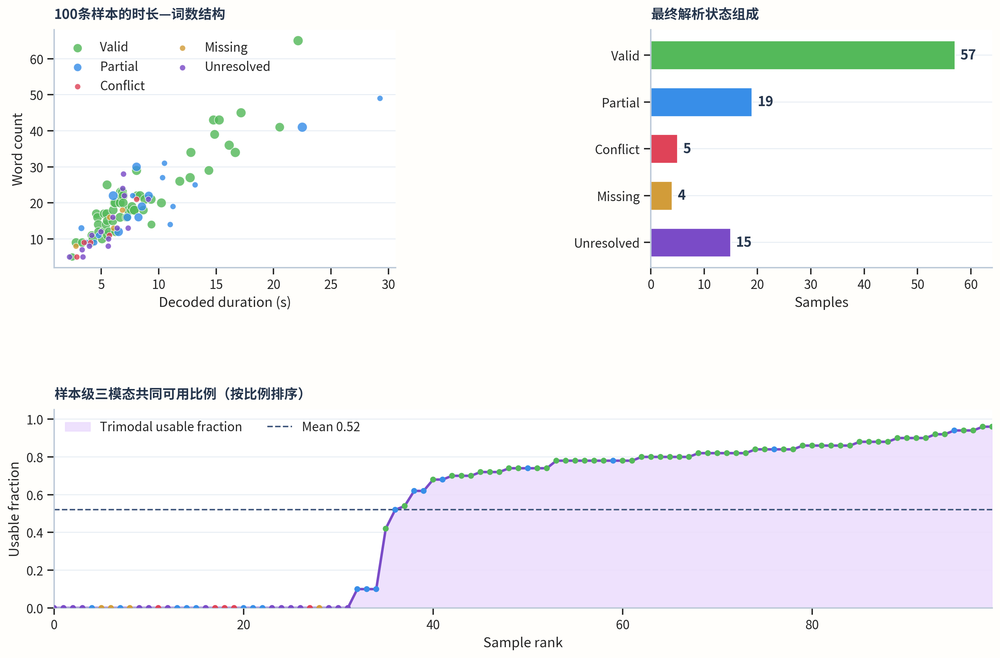

点大小表示三模态共同可用比例，颜色表示最终状态；状态是自动证据规则结果，不是人工准确率。

[底表](data/Q1F_01_sample_overview.csv)

### Q1F_02_modality_coverage · 样本级模态可用比例分布

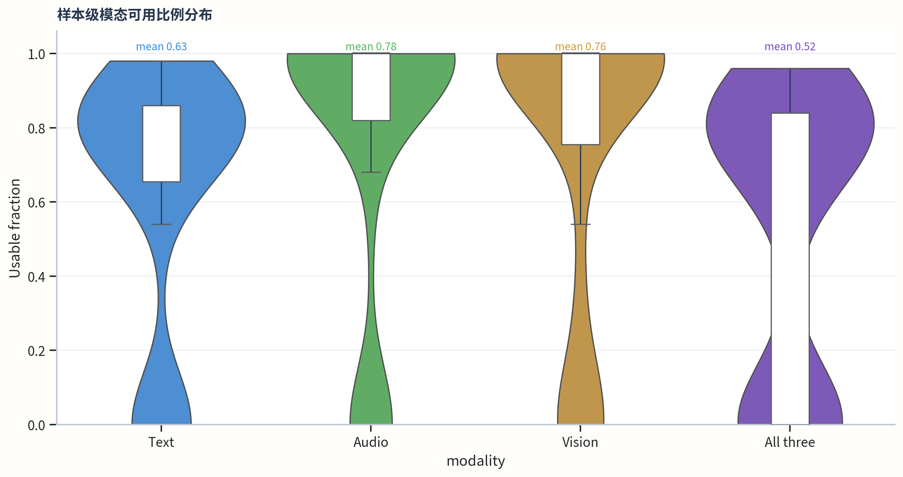

小提琴显示100条样本分布，箱线显示中位数和四分位数；可用比例是流程覆盖指标，不是识别准确率。

[底表](data/Q1F_02_modality_coverage.csv)

### Q1F_03_stage_coverage · Formal、Stage 2 与 Stage 3 覆盖率

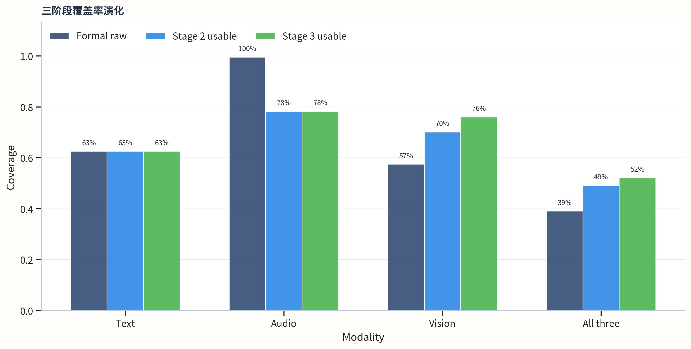

Formal为原始观测覆盖，Stage 2/3为固定规则允许使用的覆盖；不同口径不应直接解释为提取器精度。

[底表](data/Q1F_03_stage_coverage.csv)

### Q1F_04_resolution_status · 最终状态与未决原因

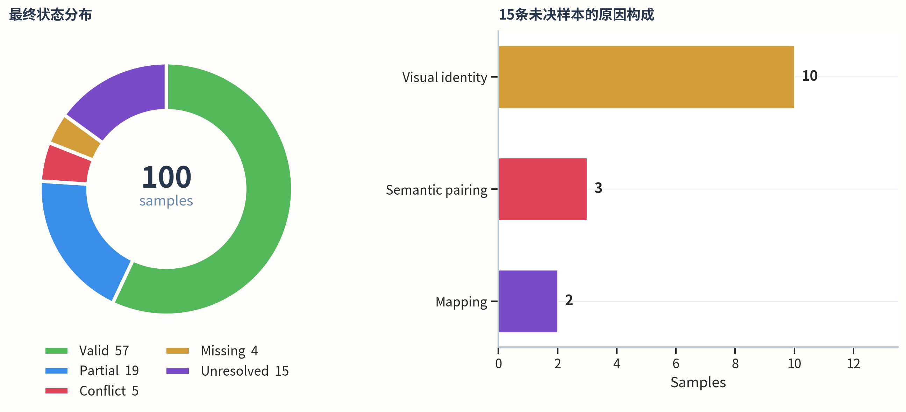

未决样本全部保留并显式屏蔽不安全模态；未决原因不是人工审计结论。

[底表](data/Q1F_04_resolution_status.csv)

### Q1F_05_status_coverage · 最终状态与可用比例关系

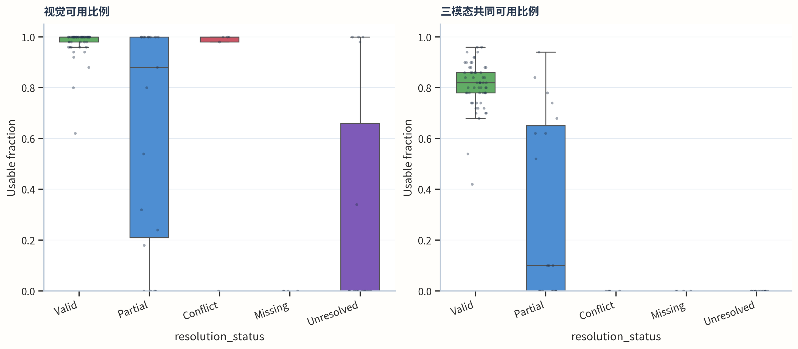

每个点是一条样本；状态分层用于审计覆盖差异，不表示状态标签的准确率。

[底表](data/Q1F_05_status_coverage.csv)

### Q1F_06_paired_frontier · 严格配对与模态可用率边界

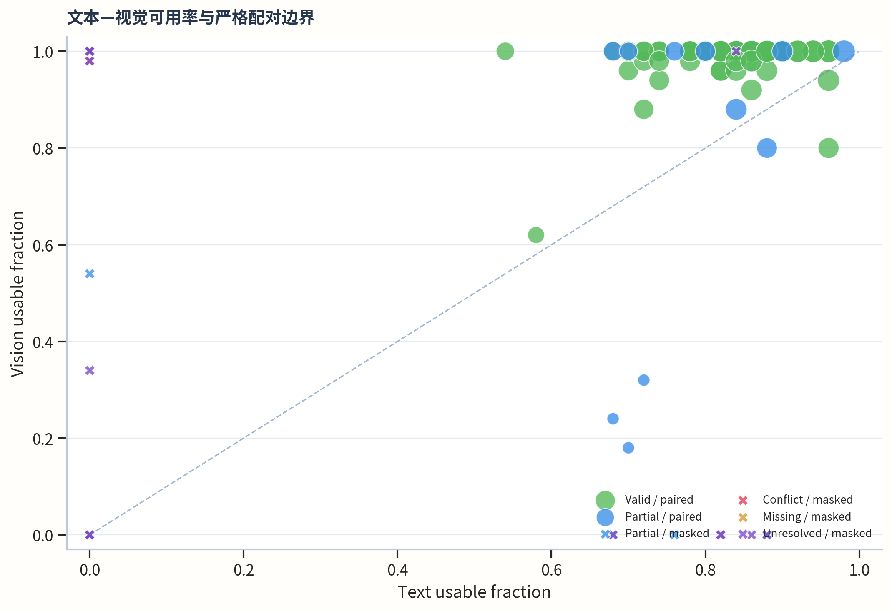

圆点为paired_use=1，叉号为paired_use=0，点大小表示三模态共同可用比例。

[底表](data/Q1F_06_paired_frontier.csv)

### Q1F_07_word_coverage · 词级音视频覆盖分布

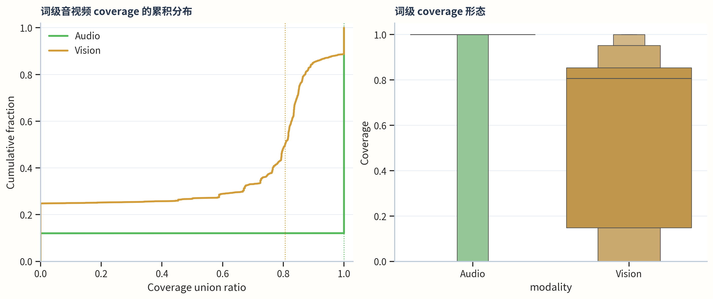

coverage 是词区间与原生观测区间并集的时间比例，不是对齐正确率。

[底表](data/Q1F_07_word_coverage.csv)

### Q1F_08_compact50_profile · 固定50窗口覆盖与观测剖面

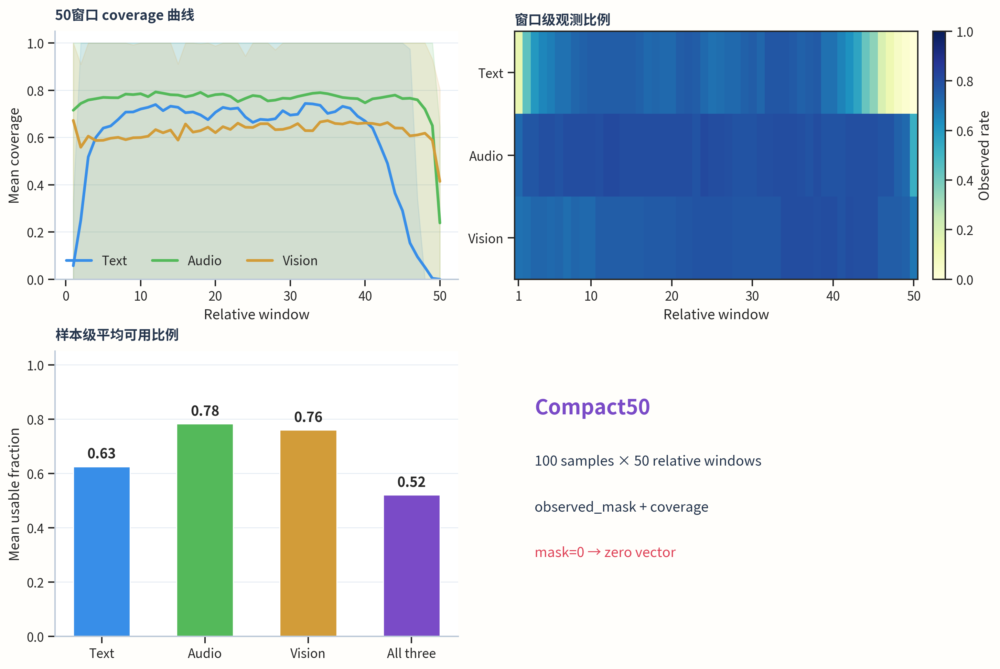

曲线带为样本间10%–90%区间；固定窗口是相对时长表示，不是原始帧数。

[底表](data/Q1F_08_compact50_profile.csv)

### Q1F_09_typical_alignment · 典型样本的词级跨模态对齐

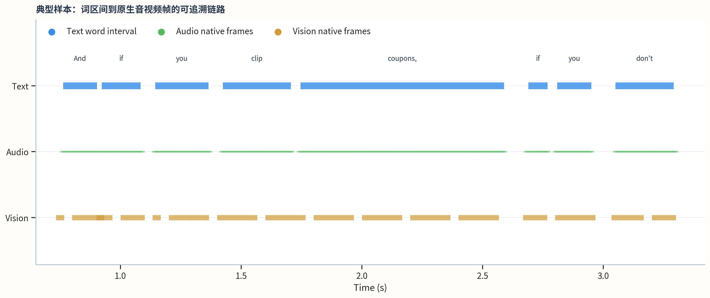

蓝色为8个词区间，绿色为词区间内全部音频原生帧，金色为视觉原生帧；该样本不使用情感标签。

[底表](data/Q1F_09_typical_alignment.csv)

### Q1F_10_abnormal_mask · 自然缺失样本的模态屏蔽

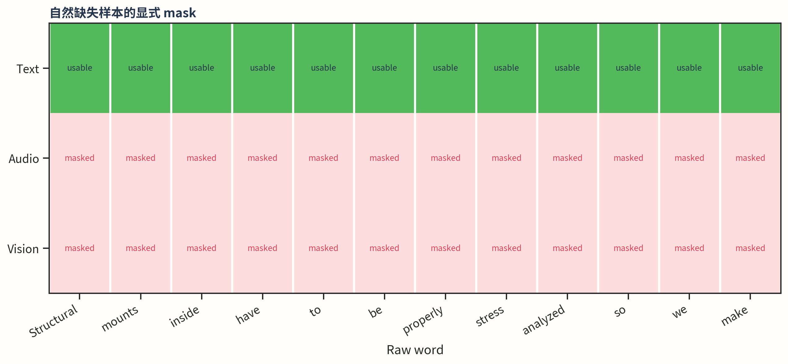

文本保留，音频与视觉被显式 mask=0 且 coverage=0；不插值、不借用其他人物特征。

[底表](data/Q1F_10_abnormal_mask.csv)

### Q1F_11_source_density · 词级 CSR 来源密度

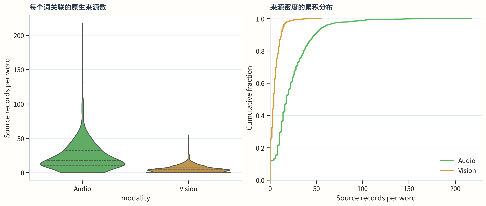

来源数来自词到原生帧的 CSR indptr，不等于独立观测样本数。

[底表](data/Q1F_11_source_density.csv)

### Q1F_12_quality_axes · 语义、时间、视觉与映射质量轴

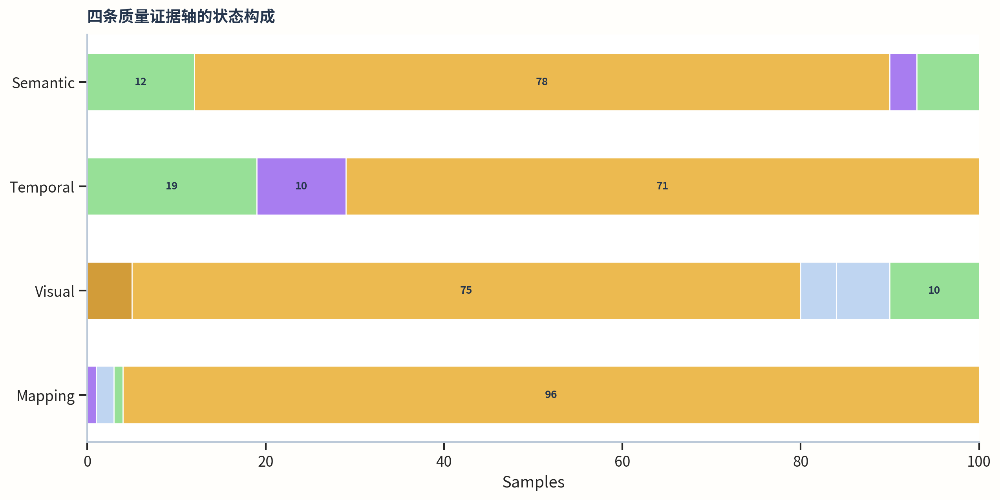

各证据轴独立统计；状态分布不等同于人工精度或情感分类性能。

[底表](data/Q1F_12_quality_axes.csv)

### Q1F_13_window_status · 固定窗口可用率与最终状态

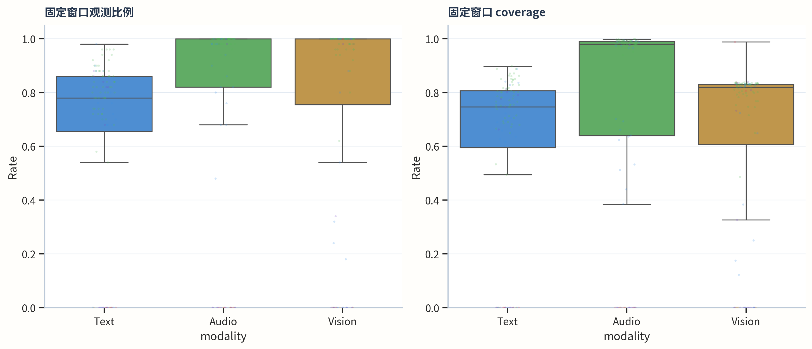

每个点对应一条样本—模态组合；散点颜色表示最终状态。

[底表](data/Q1F_13_window_status.csv)

### Q1F_14_feature_contract · 词级与固定窗口特征输出契约

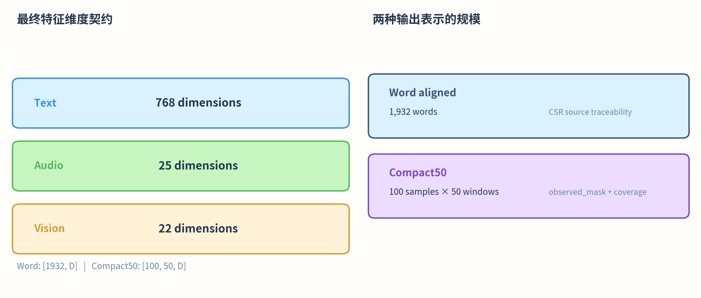

展示最终冻结接口的维度和规模；不是模型准确率比较。

[底表](data/Q1F_14_feature_contract.csv)
